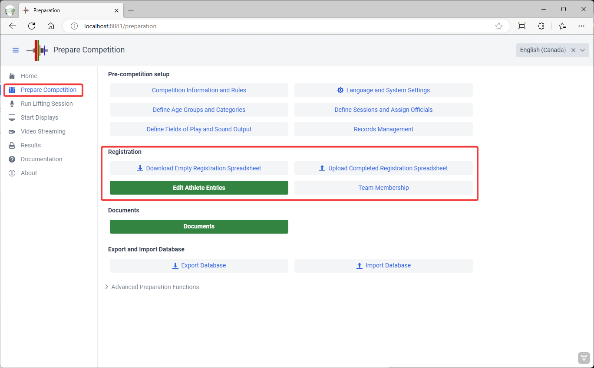
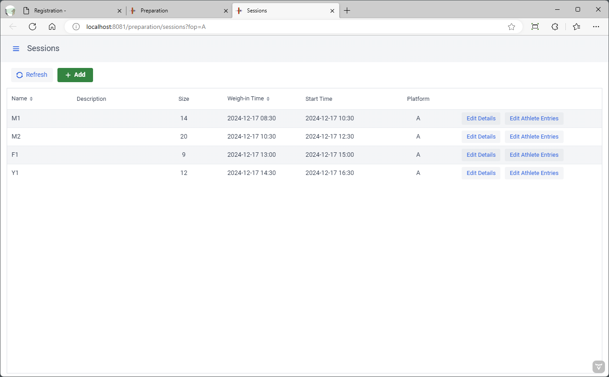
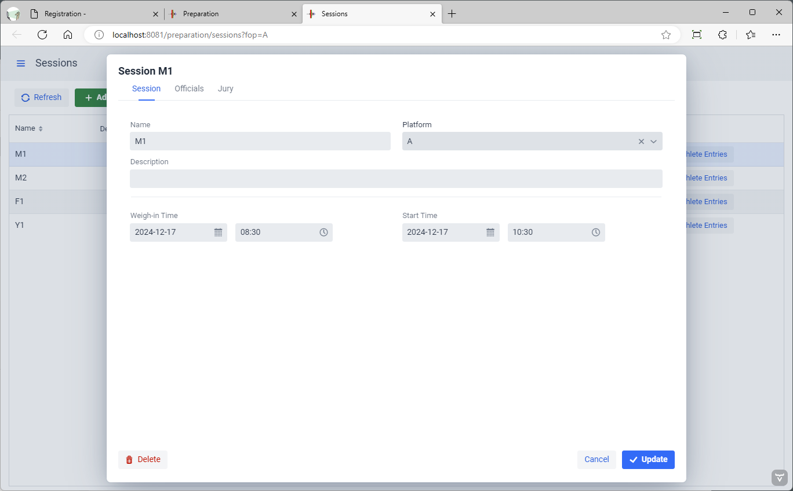
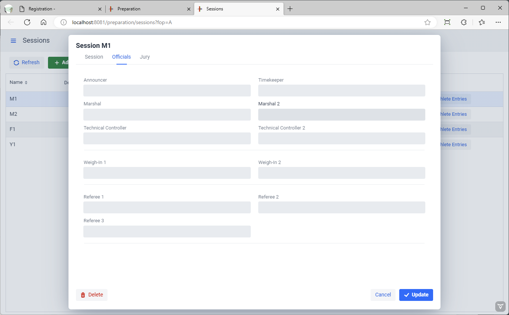
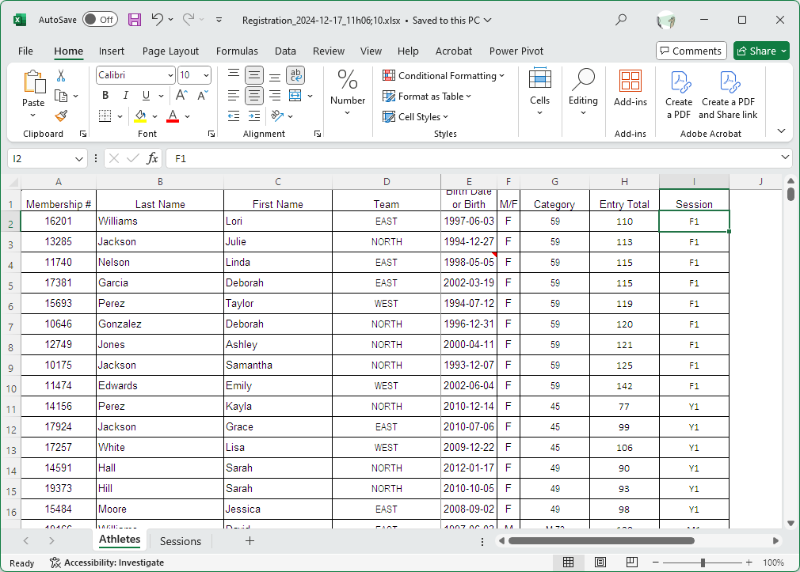
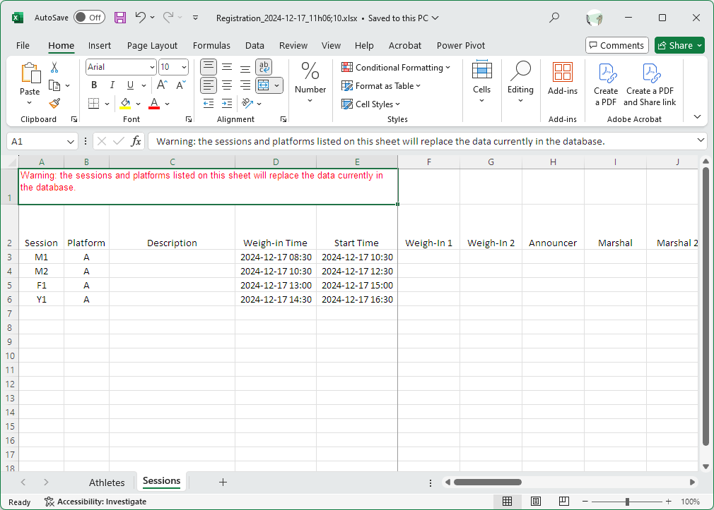

The next step in preparing a competition is registering the athletes.  This involves

- Defining the age groups and the categories
- Defining the competition groups
- Entering the initial list of participating athletes
- Assigning athletes to groups

These steps are performed from the `Prepare Competition` page

## Defining Age Groups and Categories

owlcms assigns athletes to their correct age group and body weight category within the age group.  In order for this to work, the definitions must be correct according to the competition's rules.

***It is therefore very important that the age groups and categories be defined first !***

- By default, OWLCMS is set up for an informal club meeting, with no age restrictions and additional light body weight categories for kids.  We will use this simple setup for most of this tutorial. 

- OWLCMS also supports all the usual variations for normal and Masters age groups. **Please refer to the [Define Age Groups and Categories](2210DefineAgeGroupsAndCategories) page for how to proceed for the following cases.**

  - Official IWF age groups and bodyweight categories.
  - Specific Age Groups for a federation (there may be a predefined age group definition for you to use)

  - Masters competitions, where athletes are automatically assigned to an age group based on their birth date according to IWF Masters rules

## Editing Competition Groups

From the `Prepare Competition` page, clicking `Define Groups` allows you to create or edit competition groups.  You can use the `+` on the list of groups to create additional groups.

Clicking on a group or using the `Edit Details` button enables you to define the expected starting time. This will be used to order the sessions on the start list or schedule.

The other tabs allow you to enter the officials and the jury.  These will be printed by default on the session protocol and jury sheets.

## Downloading an Empty Registration Spreadsheet

There are two ways to enter athletes.  For a very small competitions, you can enter them interactively using the `Edit Athlete Entries` screen.  But as soon as you have more than about 20 athletes, it is much easier to use a spreadsheet.

From the `Prepare Competition` page, 

- click on the `Download Empty Registration Template` button.  This will download a file with the sessions you created before.  

- Save the downloaded file to your own documents area

## Preparing a Spreadsheet (Automatic Category Assignment Mode)

Because entering athletes is tedious, it is easier to upload a list prepared with Excel which allows copy-and-paste in an easier way.  

This method will automatically assign athletes according to their age and assigned category.  If athletes are eligible to more than one category, they will be assigned to all categories,

See below for explicit category assignments.

1. Fill the Excel with the information about your athletes.  

   - For each athlete, you need to provide at least the birth year, the gender, and a way to determine the body weight category.
     - The most intuitive way is to enter the category limit in the category column.  For a M89 category, the gender would be M and the category column 89.  
     - For heavyweight categories you can use 109+ or >109. 
       BUT if there are overlapping age groups with different categories, it is better to enter the expected bodyweight. For example for a Youth expected to weigh 105, you can enter 105 in the bodyweight column and leave the category empty. The athlete will be correctly placed in the YTH >102 and JR 109 categories.
     - We recommend that you use the international `yyyy-MM-dd` format for dates (4-digit year, month, day) but the program should recognize correct Excel dates as well.

   

2. The groups that you use on the "Athletes" tab **must** be defined on the second "Groups" tab.  If you need new groups, go add them to the Groups tab. An example of the Groups tab is shown below.

   - The program will create groups with the code names you use.  You can use numbers, or any short combinations.
   - You should use the Description field instead of making complicated group codes.  This will be used as a description.

   - You can leave the times alone and fix them later in the program.  But if you are entering them in the spreadsheet either use the format that Excel shows you</u> (which may vary based on your Office and operating system settings) or (even better) use the international `yyyy-MM-dd hh:mm`  format (4-digit year, month, day, 24-hour hour, minutes).

   

## Initial Upload of the Completed Spreadsheet

1. **Upload the completed form** using the `Upload Completed Registration Spreadsheet` button. Note that this **deletes the previous athletes and groups** 

   The Excel sheet should contain all the athletes that will compete.

2. **Fix errors**, if any. If there are errors detected on the upload, they will be shown (for example, unreadable dates in a cell, or a missing group).  The athlete will still be created, but without the faulty information.  You can either upload again after correcting.  If you use the program to fix the errors, make sure you export the information so you can reload it later.

## Initial Schedule and Allocation of Athletes

Change your initial spreadsheet and add sessions to the Sessions tab until you are satisfied that you have a good first approximation of your competition with a workable schedule.

## Preparing a Spreadsheet (Explicit Category Assignment Mode)

Sometimes there are additional competition categories created for special awards.  For example, there may be a national competition hosted in a state, and the state competition will take place at the same time.  In such a case, it will be necessary to use explicit names of categories in the file.

As an example, we assume that the National competition will use the Open categories. If we go to the Age Group definition page, we notice that the categories are named "W55" "W 59" and so on. **You must use the same category names are shown on the Age Groups page**

For the state championship, an additional age group has been created for men and one for women, with the same weight categories.  Assume that the State age group has the code ST.  The categories would be "ST W 55" and so on.

The categories are listed in sequence. The first category listed is the one that will be shown on the scoreboard. It determines when the athlete will compete.  If an athlete is both Youth and Junior, the Youth category would go first.

In our example, we have 3 cases

- Athlete competes in both National and State.  We want National to be shown.  A female 55kg athlete would be entered as
  `W 55;ST W 55`  

- Athlete competes in National only
  `W 55`

- Athlete competes in State only.  For these athletes, it is presumed that they did not meet the qualifying total for the National, and they will be shown as state-only on the scoreboard

  `ST W 55`

Say that we also have Masters taking place at the same time.  National Masters use the normal `W40 55` groups.  State Masters have been given a STW40 age group, and would be noted `STW40 55`.

In such a case, an athlete eligible to all 4 would be noted `W40 55;STW40 55;W 55;ST W 55`.  We put `W40 55` first so that this is shown on the scoreboard.