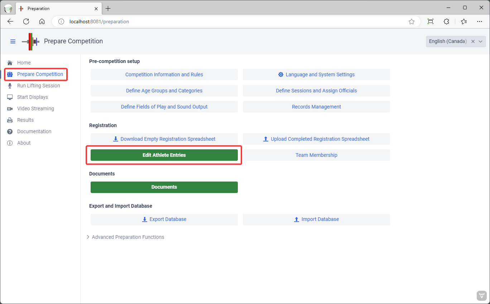
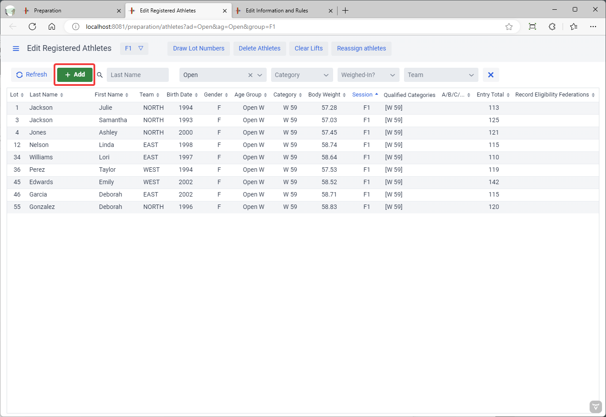
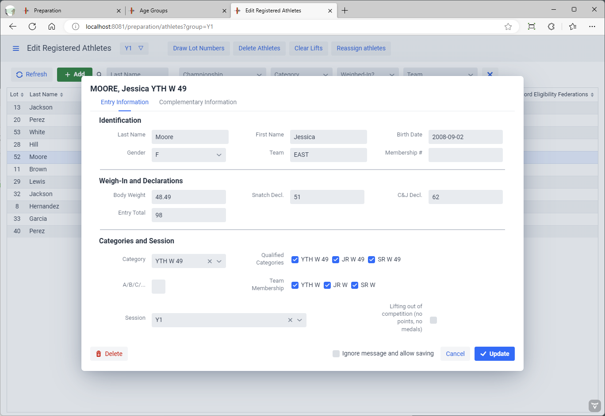
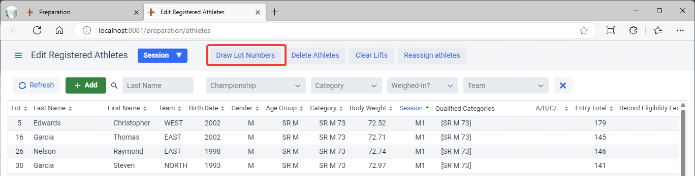
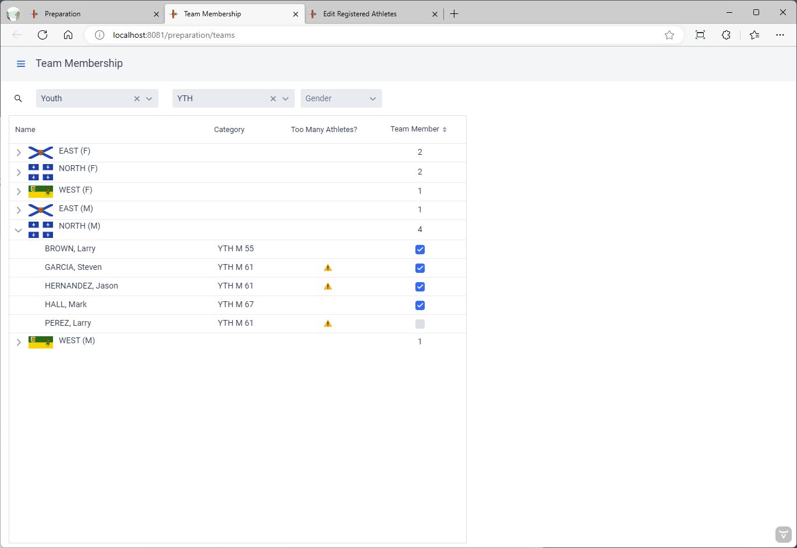
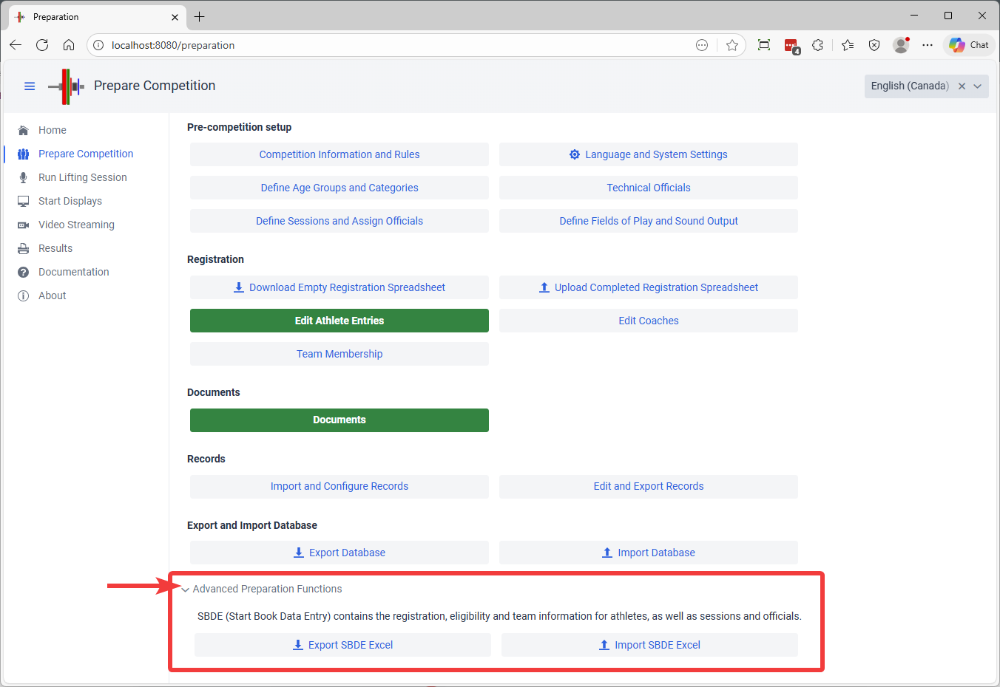
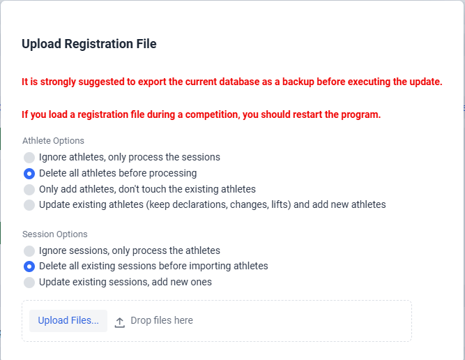

The next step in preparing a competition is adjusting the registrations and finalizing the entries.  This involves

- Adjusting the list of participating athletes
- Drawing lots
- Finalizing the assignment athletes to groups
- Assigning Referees to groups
- Producing a Start List
- Producing Athlete cards

These steps are performed from the `Prepare Competition` page

## Adding or Editing Athletes

In order to add or edit athletes, use the `Edit Athlete Entries` button.

- To add an athlete, use the `+` button at the top of the list.  If you have selected a session at the top, the athlete will be added to that session.
- To edit an athlete click ONCE on the name of the athlete in the list.  You can select a group at the top and type values in the filters at the top of the list to narrow down the list.
- You may then fill the form.  The eligible categories will be computed automatically, and if the athlete is eligible to several categories the most specific category will be used as the registration category.  In the following example, a 16 year-old is eligible for youth, junior and senior medals.  If the competition is organized by age groups, the athlete would lift along the other youths, prior to junior and senior athletes.

Complementary information can be provided if needed, on the second tab.

## Drawing lot numbers

**Once all athletes have been entered, you should draw the lot numbers**.  If you are splitting a group and have several athletes with the same entry total, you would use the lot number to determine what athlete goes to which group.

## Team Membership

Before [producing the Start List and Team Lists](2400PreCompetitionDocuments), it is important to make sure that the team memberships are correct.  The `Team Membership` page makes it possible to see the team members for each team. 

On initial load, the athlete is automatically made a team member for all the age groups in which he is qualified.  If an athlete qualifies for both JR 55 and SR 55, he is assumed to be part of the JR and SR teams.

You should filter the championship and age groups to make sure all teams follow the competition rules.  Warning flags are shown  when there is a risk of violating rules.

In the following example, 3 female and 3 male athletes are kept on the WEST team

## Major Changes

If you need to make important changes, such as reorganizing the groups, and so on, you can export what you have already loaded back to an Excel sheet, do the changes in Excel, and reload.  The Start Book Data Entry (SBDE) export format preserves everything about the athlete categories, team memberships, group assignments, and officials.

The SBDE format is available at the bottom of the preparation page. 

### SBDE Loading Options

When loading an SBDE file, there are several options

Athlete Options are as follows

- Ignore Athletes: only the session tab of the SBDE file will be processed
- Delete alll athletes: This is the usual mode, the athletes will be reinitialized according to what is in the file.  Obviously, this should not be done once a competition has started
- Add athletes: this is used in long running multi-age group competition that have more than one Verification of Final Entries
- Update Athletes: This is used to reallocate athletes in sessions once a competition has started, or to fix the categories.  This should always be tried first on a separate laptop, after exporting the current database.

Session Options are as follows.

- Ignore the sessions: only the first tab will be processed
- Delete all sessions: this is used normally when doing a full reset of the content
- Update existing sessions: this is normally used to update the referees allocated, or the schedule

### Explicit Category Enumerations

If you export the information after loading the database, the format for categories includes the additional eligibilities if any, and the team memberships. The format is as follows

- The main category is first.  For a Youth athletes, this could be `YTH M 81` as an example.  If there are no additional eligibility categories, then only the main category is shown. 
- If the athlete is eligible to more than one category because qualifying totals were met, the additional categories are added are separated by a `;`. So a YTH athlete also eligible to both JR and SR would be `YTH M 81;JR M 81;SR M 81`  and if only eligible for JR, the string would be `YTH M 81;JR M 81`  (Note that you may also see | as the first delimiter in some exports, it means the same).
- Any category can be annotated with `/NoTeam` if the athlete is not part of the corresponding team (by default, an athlete is included in the teams where he is eligible).
  In our example, if the athlete is eligible for SR but is NOT included in the SR team, then `/NoTeam` is added to the team from which the athlete is excluded.  In that case, the string will be `YTH M 81;JR M 81;SR M 81/NoTeam`.  The annotation also works on the main category `YTH M 81/NoTeam` is a legal specification.
- The recommended practice is to load the database, and do the eligibility or team adjustments using the program, and then re-export. Exporting and re-importing is very useful when reallocating groups, less so when doing minor changes.

