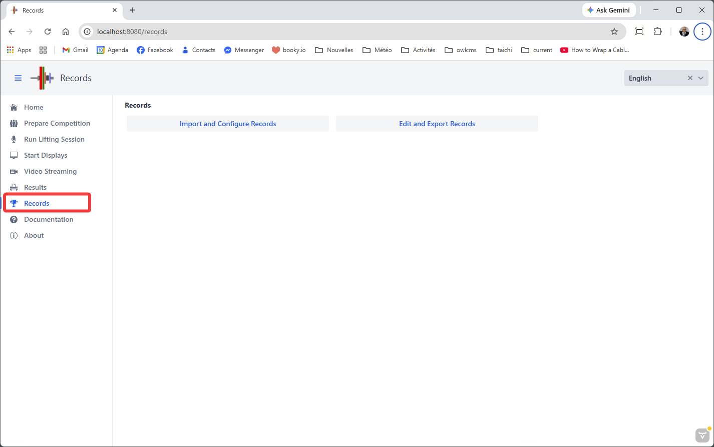
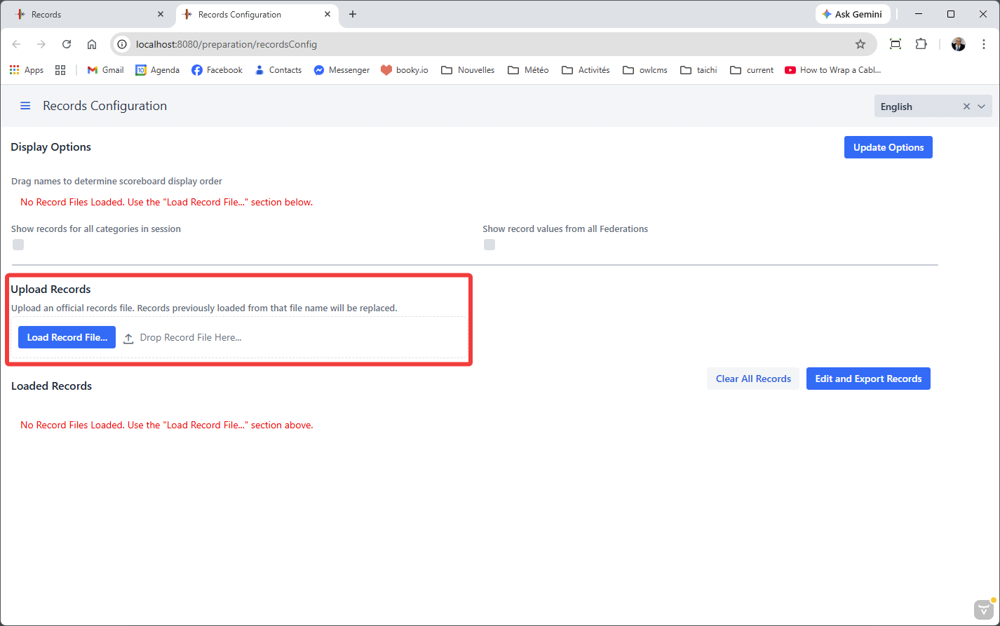
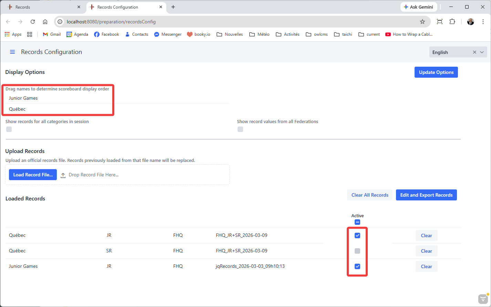
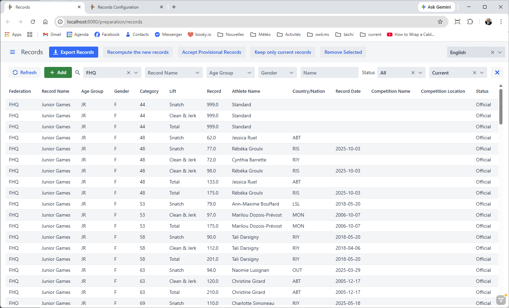
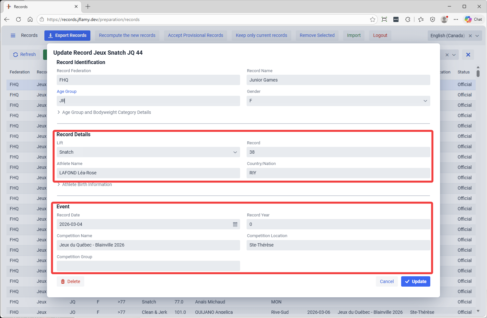
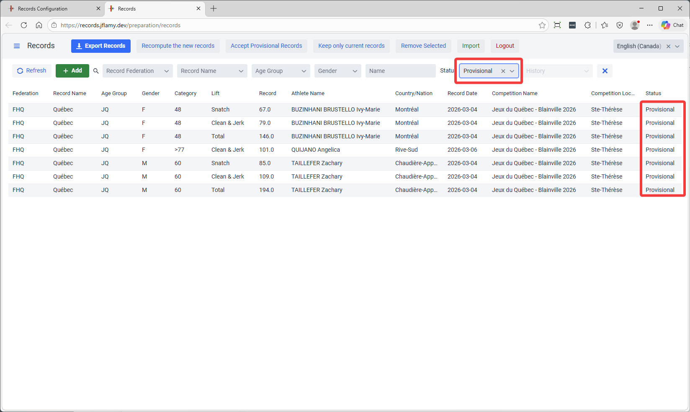
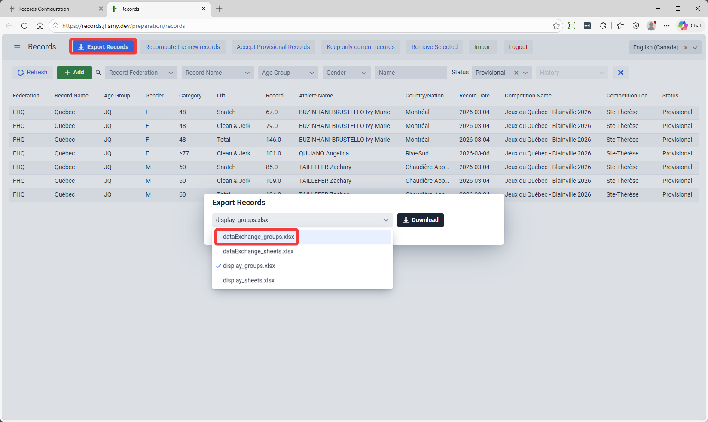
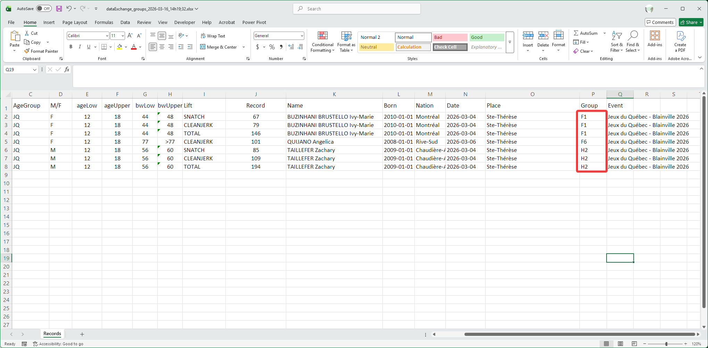
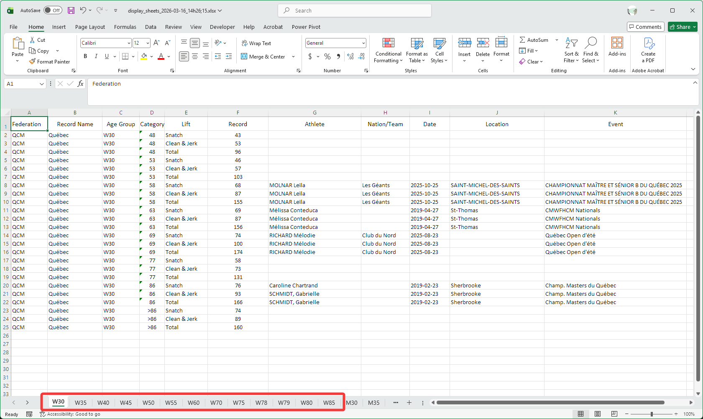
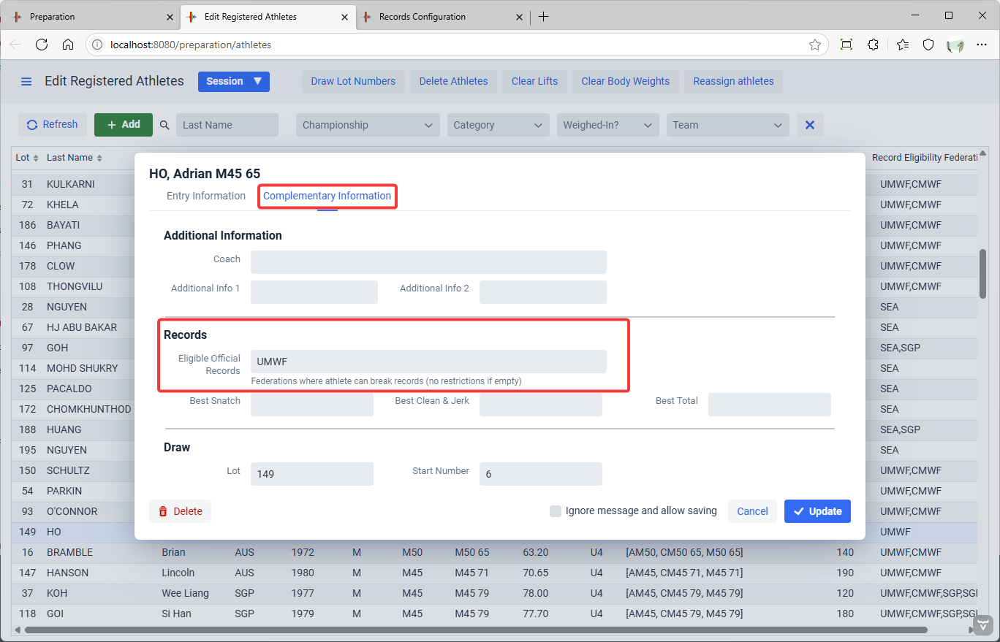

Record definition files can be loaded in owlcms so that when an athlete is about to lift, the records for his/her categories can be shown.  As many record files as needed can be loaded, so that state, national, continental, world, or event-specific records can all be shown.

In the following example

- the athlete can potentially break records in categories from two age groups (JR 71 and SR 71)
- the next lift would break the records highlighted in purple (assuming of course that the athlete meets citizenship and that other record requirements such as proper referee levels are met).
- the athlete had, in fact, just set the records on the previous lift-- the system updates the display when a record is provisionally set during a meet.

*Official records* are provided in Excel files that are loaded in the system.  

- Sample record files for regular categories and for Masters can be found [here](https://drive.google.com/drive/folders/1k14vBh2vD-5qKoScxuOBZMEfI0U2QQrk?usp=drive_link)
- The format for these files is explained [below](#record-file-format).

- It is convenient to store record files as cloud spreadsheets, giving writing permissions to the federation's record secretary.  Then any club can download them and load them for their local meets.

If records are broken during a meet, they are stored in the database with the session in which the record was broken.  This marks them as *provisional* records. This provisional status needs to be explicitly accepted for the record to become official (see below).  The federation can then update its file and re-publish a new Excel.  It is possible to set up a [Record Repository](RecordsRepository) to make these tasks easier.

## Record Management

The Record Management pages reached from the Records menu entry

### Loading Records

To reach the page where record definition files are loaded, click on the "Import and Configure Records" left button.
You can then load record files as you wish. 

For our example, we will load records for regional youth games, and the normal regional records.  After loading the two files, we have the following situation:

- In our provincial record files, we had several record age groups.  We unchecked the SR records because they are not relevant for this event
- We can control in what order the records will be shown.  We want our event records shown first, above the provincial records.

## Display Options

There are additional display options in the top section

Normally, the scoreboard will only show the records for which the current athlete is eligible (for the age groups and federations in which he is eligible)

- You may want show all the federations (the South American records and PanAm records would be shown for Canadian athletes even though they are not eligible to beat the South American record -- see [Controlling Eligibility](#controlling-eligibility) below

- You can select to show all the records for all the athletes in the session during the whole session instead

## Viewing Records

Using the other button ("Edit and Export Records")  we can see the records we have loaded

## Updating Records Interactively

The first option to update records is to edit them directly in the database, and re-export the records after doing the edits.
To do so, click on the record.

NOTE:  if you enter something in the Competition Group at the bottom, this normally indicates the session in which the record was broken, and is understood to mean that the record is provisional.

## Exporting New Records and Updating Using Files

At the end of the competition, all new records are marked as provisional.  You can see the new records by using the Status dropdown in the filter bar and selecting "Provisional".  For example

Using the Export Records at the top and choosing a "dataExchange" template will produce an Excel File that you can then load into OWLCMS or in a [Record Repository](RecordRepository)

The resulting file is in the exact same format as the record inputs, so you can merge it in Excel format if you prefer. As mentioned earlier, it is the presence of information in the Group column that indicates that the record is provisional.  To approve the records, you either clear the cells before loading, or you use the "Accept Proviional Records" button in the application after loading.

## Producing Records for Publishing

When Exporting, you can select templates. For inclusion on a Web site, you can use the "display" templates.  This will give you an output where the column heading are translated in your langage.

- The "groups" template puts all the categories on a single page, with group headers
- The "sheets" template puts each gender and age group as a separate page.
- When using a mail merge program to produce pretty documents, you may want to use the dataExchange format to get a flat file without headers.

For example, exporting Masters records in the sheets format yields an Excel of the following form

## Recomputing Records

Say for example you loaded an obsolete version of a record file, or forgot to load one, and you realize after the competition has started.  No problem. You can recompute all records that were improved by using the "Recompute Recordsbutton in the top bar.
This will essentially replay all the lifts in the competition order, so the improved records are recomputed in the correct order.

## Controlling Eligibility

For each record definition there is a Federation field.  In the screenshot below the federations are UMWF and CMWF.   Some athletes are eligible to UMWF but not CMWF.  The information about record eligibility is part of the athlete registration form (found under Edit Athlete Entries during the preparation).

In the following example, we state that the athlete is eligible to UMWF only, and not CMWF.   To say both, we would have written `UWMF,CMWF` .  This information can be entered using the full start book data entry (SBDE) advanced registration sheet format.  If there is no information in that field, records from all federations are considered breakable.

Note that if in your national federation you have Masters-aged athletes that can beat Masters records and others that cannot, you will need to create a use a separate Masters federation acronym in your record definitions to make the eligibility criterion work.

### Eligibility Criteria

For a record to be broken, in addition to meeting the age and bodyweight requirements, the athlete must be eligible according  to the Federation Eligibility Field

For each record in the record definition Excel, there is a federation code.

In the database, the athlete's registration record can optionnally have a list of federations under which they can break records.

- By default, the list is empty and athletes are eligible for the records from all the listed federations if they meet the age group, age and weight requirements.
- If a list of federations (comma-separated) is given, the athletes are restricted to these federation records.

##### **Example 1:**

- Joint IWF-certified Canada-USA-Mexico meet.  All athletes can break records for their country, and also a PanAm record.
- The record files have PAWF for PanAm records, CAN as federation for Canadian Records, USA for American Records, MEX for Mexican Records.
- A Canadian athletes would have `CAN,PAWF` as their Record Eligibility Federations on the the Athlete registration page

##### Example 2:

- If, in a joint South American and PanAm championship, `SudAm` and `PanAm` records have been loaded, then South American athletes would have `SudAm,Panam` and all others (such as North American Athletes) would have only `PanAm` to determine who can break what record.

## Record File Format

The following fields are expected in the file, in that specific order.  The first line contains the names of the field.  The program stops reading at the first line where the Federation field is blank.

| Field      | Content                                                      |
| ---------- | ------------------------------------------------------------ |
| Federation | The acronym of the federation with authority to certify the record.  In competitions that involve athletes from multiple federations, this can be used to check whether an athlete belongs to the correct federation to break a record (see [Eligibility Criteria](#eligibility-criteria) below). Using the official federation acronym is recommended (e.g. IWF) |
| RecordName | The name of the record, used for naming the rows in the display.  The values in this column *can be translated to the local language.* For an IWF record, the name will likely be "World". **Note:**  Because the name of the files controls the ordering of the rows, records that bear the same name should all be in the same file.  If you have "National" Masters records and "National" SR records, and you want them to be on the same row, then combine the two in the same file.  Otherwise there will be several rows with the same name. |
| AgeGroup   | The age group to which the record applies.  The codes should match those that have been specified when loading the Age Groups (see the [Age Groups and Categories](Categories) page).  In competitions that involve multiple age groups, this can be used to determine which records can be broken by an athlete (see [Eligibility Criteria](#eligibility-criteria) below). Note that there can also be records whose age group does not match a competition age group -- for example, a record that can be broken by anyone.  If the name does not match an age group active in the competition, the eligibility checks will be skipped. |
| Gender     | M or F depending on the gender of the athlete.               |
| ageLow     | Lowest inclusive age for breaking the record.  For IWF JR, you would use 15. |
| ageCat     | Highest inclusive age for breaking the record. For IWF JR you would use 20. Use 999 when there is no upper limit. |
| bwLow      | Lowest *exclusive* body weight for breaking the record.  For the women under 55kg category, this would be 49 with the understanding that the body weight must be strictly above 49. |
| bwCat      | Highest *inclusive* body weight for breaking the record. For the women under 55kg category, the field would be 55. |
| Lift       | The kind of record: `SNATCH`, `CLEANJERK`, `TOTAL`.  Note that only the first letter (`S` `C` `T`) is actually checked. |
| Record     | The weight lifted for the record                             |
| Name       | (Optional) The name of the athlete holding the record (optional).  Not currently displayed by the program, but available in some federations' databases; could be used in the future. |
| Born       | (Optional) The date of birth of the athlete holding the record |
| Nation     | (Optional) The nationality of the athlete holding the record.  Not currently displayed by the program, but available in some federations' databases; could be used in the future. |
| Date       | (Optional) The date at which the record was established (optional).  Not currently displayed by the program, but available in some federations' databases; could be used in the future. |
| Place      | (Optional) The location where the record was established. Typically City, Country. |
| Event      | (Optional) The event where the record was set (ex: Paris Olympics) |

The following figure shows the content of the 10_Canada file, organized with one age group per tab.

