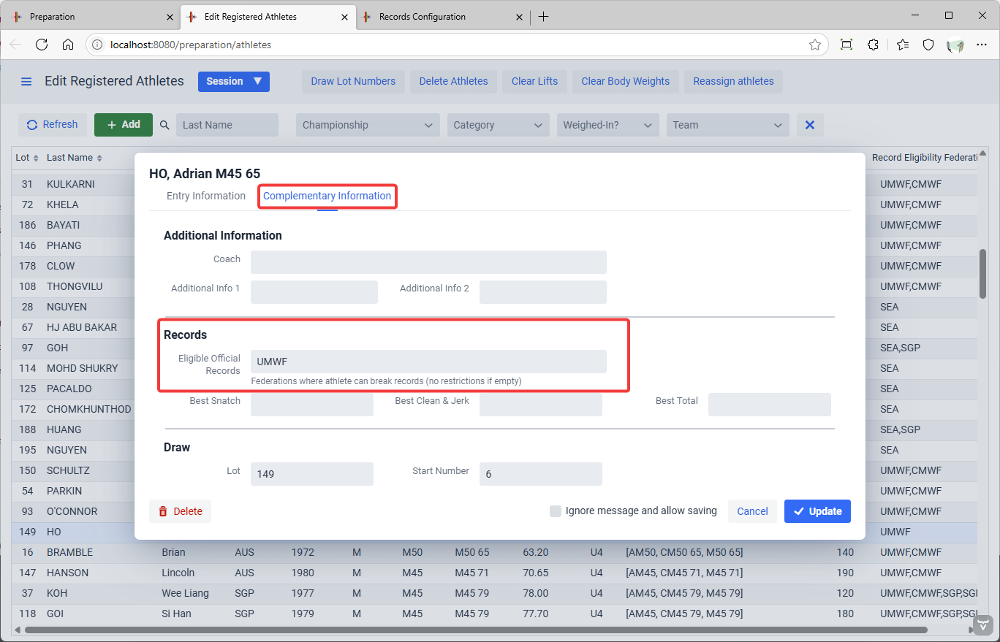
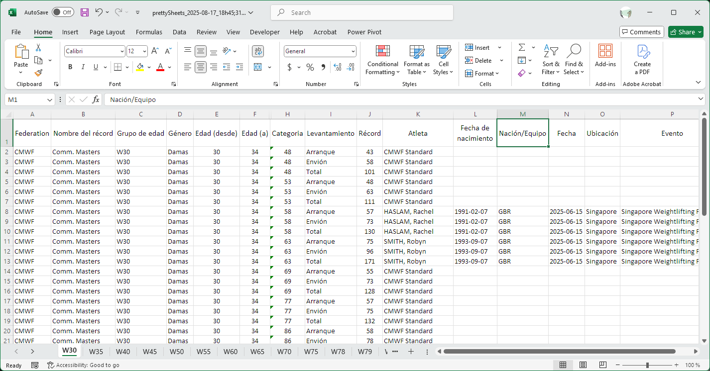

Record definition files can be loaded in owlcms so that when an athlete is about to lift, the records for his/her categories can be shown.  As many record files as needed can be loaded, so that state, national, continental, world, or event-specific records can all be shown.

In the following example

- the athlete can potentially break records in categories from two age groups (JR 71 and SR 71)
- the next lift would break the records highlighted in purple (assuming of course that the athlete meets citizenship and that other record requirements such as proper referee levels are met).
- the athlete had, in fact, just set the records on the previous lift-- the system updates the display when a record is provisionally set during a meet.

*Official records* are provided in Excel files that are loaded in the system.  The format for these files is explained [below](#record-file-format).

- An example record file can be found [here](https://github.com/jflamy/umwl/raw/refs/heads/main/Singapore2025-06/records/UWMF/Current/SourceOfTruth_exportSheets_2025-06-16_21h21;59.xlsx).
- It is convenient to store record files as cloud spreadsheets, giving writing permissions to the federation's record secretary.  Then any club can download them and load them for their local meets.

If records are broken during a meet, they are stored in the database.  They are *not* considered to be official records.  For them to become official, they need to be approved by the appropriate association or federation, and then added to the correct Excel file.  Once the Excel file has been updated, it becomes the new reference and can be loaded again in the database.

## Record Management

The Record Management pages are reached from the Prepare Competition page

### Loading Records

To reach the page where record definition files are loaded, click on the "Import and Configure Records" button (A)

We will load the UWMF records as they were before the 2025 Masters World Cup, and then load the Commonwealth Masters Standards to illustrate that several federation standards can be used concurrently.

First, the UWMF records.

This then shows a list of loaded records

## Multiple Records and Display Order

It is also possible to add records from multiple federations or to add records that are specific to an event. 

We proceed the same way for the Commonwealth Masters records.  And we notice that in the top section we can reorder the federations to control the order on the records sections of the scoreboard.

There are additional display options in the top section

Normally, the scoreboard will only show the records for which the current athlete is eligible.

- It is sometimes desired to show the records for all the body weight class in a session, or all the age groups in a a session, if they fit on the scoreboard.  The "Show records for all categories in session" checkbox enables this.
- The "All Federations" checkbox can also be used in multi-regional events. In a joint PanAm + South American event, some athletes could beat PanAm Records only, others might beat South American *and* PanAm records.  The key is to correctly set the eligibility criteria for the athletes. See [Eligibility Criteria](#eligibility-criteria) below.

## Controlling Eligibility

For each record definition there is a Federation field.  In our example, the federations are UMWF and CMWF.   Some athletes are eligible to UMWF but not CMWF.  The information about record eligibility is part of the athlete registration form (found under Edit Athlete Entries during the preparation).

In the following example, we state that the athlete is eligible to UMWF only, and not CMWF.   To say both, we would have written `UWMF,CMWF` .  This information can be entered using the full start book data entry (SBDE) advanced registration sheet format.  If there is no information in that field, records from all federations are considered breakable.

Note that if in your national federation you have Masters-aged athletes that can beat Masters records and others that cannot, you will need to create a use a separate Masters federation acronym in your record definitions to make the eligibility criterion work.

## Exporting Records

The second button "Edit and Export Records" (B) is used to view, filter, export and clean-up records.

### Filters

The records are shown in a grid, as in most other owlcms screens.  Clicking on a record allows editing.

The filters at the top allow selecting records for producing reports in Excel format, and for other actions

- There are "standard" filters to locate a record -- Federation, Age Group, Gender, and athlete Name
- There are two dropdowns about the status of the records shown
  - The first one is about new records set in the competition.  New records are provisional, and not official, until approved by a federation.
    - `Provisional` means new records only. This setting is used to make up a list that can be sent to to the federation.   New records are flagged with the session in which they were set and they remain marked as provisional in this way until the "Accept Provisional Records" button is used.
    - `Official` means records previously set (their session field is empty).  These are typically loaded from a file that contains data from the federation.
    - `All` means both.  If you are confident that provisional records will stand, and wish to produce a list with all the records at the end of the competition.

  - The second drop down is about superceded records.  Some federations keep a historical record of all the improvements to a record, even during the same competition.
    - `Current` means show the last (best) record only, hide the previous ones
    - `All` means show all records, including the ones that were superceded, to have the full story.

### Formats

You can then export the selected information in Excel format.  Several templates are available by default.

- Import-Export format: used for archival and for configuring the system
  - `importFormatSheet` is one sheet per age group, more readable for humans, can be re-imported in owlcms.  You would use this to create an archive format.
  - `importFormatRecords` has everything in the same sheet, easier if you need to convert to a CSV or other flat format.  Your federation would maybe want this to validate Provisional records.
- "Pretty" format, used as a basis for publishing the records
  - `prettyGroups` removes some of the redundant columns, and translates the header row.  You would use this to produce a PDF. 
  - `prettySheets` is one sheet per age group.  Perfect for importing to Google Sheets and then embedding in a Web Site

For example, if you are in Spanish, and use the prettySheets format, you would get something like the following.  You can customize the templates and create your own, remove columns, etc.

## Editing Records

You can actually keep you records in owlcms, and edit them there prior to publishing.  You would create a full "importFormat" copy for archival, and to reload later, and you would use a pretty format for your Web site or PDF

If you get news of a new record set in another country that meets your requirements, you can actually edit a record.  Just click and edit.  You should later export it in an importable format.

## Record File Format

The following fields are expected in the file, in that specific order.  The first line contains the names of the field.  The program stops reading at the first line where the Federation field is blank.

| Field      | Content                                                      |
| ---------- | ------------------------------------------------------------ |
| Federation | The acronym of the federation with authority to certify the record.  In competitions that involve athletes from multiple federations, this can be used to check whether an athlete belongs to the correct federation to break a record (see [Eligibility Criteria](#eligibility-criteria) below). Using the official federation acronym is recommended (e.g. IWF) |
| RecordName | The name of the record, used for naming the rows in the display.  The values in this column *can be translated to the local language.* For an IWF record, the name will likely be "World". **Note:**  Because the name of the files controls the ordering of the rows, records that bear the same name should all be in the same file.  If you have "National" Masters records and "National" SR records, and you want them to be on the same row, then combine the two in the same file.  Otherwise there will be several rows with the same name. |
| AgeGroup   | The age group to which the record applies.  The codes should match those that have been specified when loading the Age Groups (see the [Age Groups and Categories](Categories) page).  In competitions that involve multiple age groups, this can be used to determine which records can be broken by an athlete (see [Eligibility Criteria](#eligibility-criteria) below). Note that there can also be records whose age group does not match a competition age group -- for example, a record that can be broken by anyone.  If the name does not match an age group active in the competition, the eligibility checks will be skipped. |
| Gender     | M or F depending on the gender of the athlete.               |
| ageLow     | Lowest inclusive age for breaking the record.  For IWF JR, you would use 15. |
| ageCat     | Highest inclusive age for breaking the record. For IWF JR you would use 20. Use 999 when there is no upper limit. |
| bwLow      | Lowest *exclusive* body weight for breaking the record.  For the women under 55kg category, this would be 49 with the understanding that the body weight must be strictly above 49. |
| bwCat      | Highest *inclusive* body weight for breaking the record. For the women under 55kg category, the field would be 55. |
| Lift       | The kind of record: `SNATCH`, `CLEANJERK`, `TOTAL`.  Note that only the first letter (`S` `C` `T`) is actually checked. |
| Record     | The weight lifted for the record                             |
| Name       | (Optional) The name of the athlete holding the record (optional).  Not currently displayed by the program, but available in some federations' databases; could be used in the future. |
| Born       | (Optional) The date of birth of the athlete holding the record |
| Nation     | (Optional) The nationality of the athlete holding the record.  Not currently displayed by the program, but available in some federations' databases; could be used in the future. |
| Date       | (Optional) The date at which the record was established (optional).  Not currently displayed by the program, but available in some federations' databases; could be used in the future. |
| Place      | (Optional) The location where the record was established. Typically City, Country. |
| Event      | (Optional) The event where the record was set (ex: Paris Olympics) |

The following figure shows the content of the 10_Canada file, organized with one age group per tab.

### Eligibility Criteria

For a record to be broken, in addition to meeting the age and bodyweight requirements, the athlete must be eligible according  to the Federation Eligibility Field

For each record in the record definition Excel, there is a federation code.

In the database, the athlete's registration record can optionnally have a list of federations under which they can break records.

- By default, the list is empty and athletes are eligible for the records from all the listed federations if they meet the age group, age and weight requirements.
- If a list of federations (comma-separated) is given, the athletes are restricted to these federation records.

##### **Example 1:**

- Joint IWF-certified Canada-USA-Mexico meet.  All athletes can break records for their country, and also a PanAm record.
- The record files have PAWF for PanAm records, CAN as federation for Canadian Records, USA for American Records, MEX for Mexican Records.
- A Canadian athletes would have `CAN,PAWF` as their Record Eligibility Federations on the the Athlete registration page

##### Example 2:

- If, in a joint South American and PanAm championship, `SudAm` and `PanAm` records have been loaded, then South American athletes would have `SudAm,Panam` and all others (such as North American Athletes) would have only `PanAm` to determine who can break what record.
