In simple club meets, it is often the case that the speaker is also the timekeeper and the marshal.  OWLCMS actually makes this easy.  Let us walk through this scenario, which will give us a good introduction to the basic concepts.

### Selecting the Current Session

The speaker is responsible for selecting the current session.  To get to the announcer screen, select "Run Lifting Session" in the menu, and click on "Announcer"

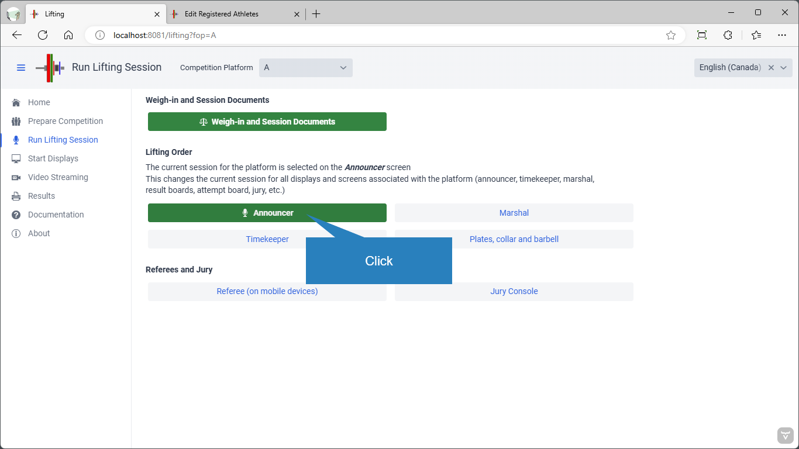

At the top of the page, select the desired session.

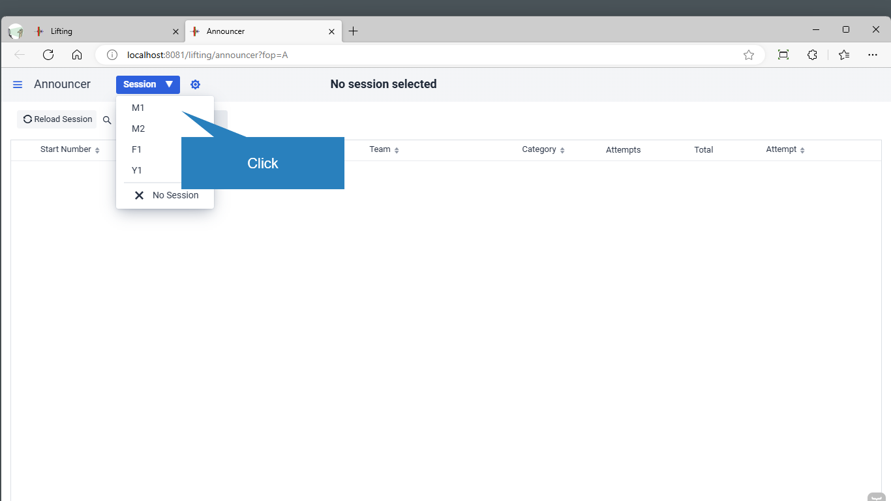

### Start Lifting

We will deal with the formal presentation and break timers in the [Breaks and Ceremonies](Breaks) section.  Let us assume that this is a simple club meet and that we want to start lifting after an informal presentation.

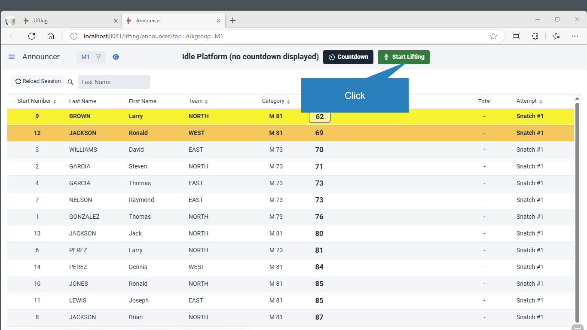

### Lifting Order

The screen shows the athletes in lifting order.  The color coding is as follows

- The top line in the grid is the athlete shown on the attempt board.  Yellow is the color used on the scoreboards to show the current athlete.  The yellow square indicates the weight being requested.  Also, the information on the top gridline matches the information at the top of the screen.
- The second line is the athlete that is preparing to lift, next in the lifting order.  Orange is used on scoreboards to show the athlete preparing.
- You may also see a blue line.  This is the athlete that lifted just before.  If the top line is blue, it means that the athlete is lifting again in sequence.  If the second line is blue, it means that the preparing athlete lifted just before.  If another line is blue, that is the athlete that lifted last.  This is useful when an athlete finishes and you want to announce the total or a 6/6

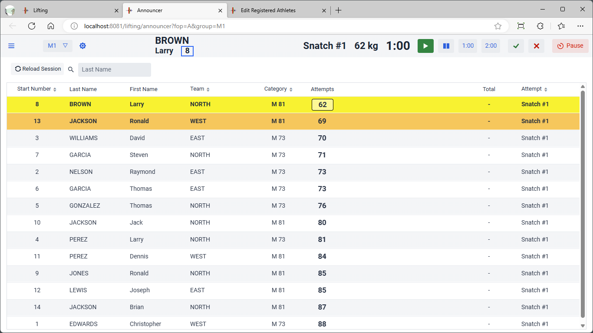

### Declarations and Changes

Clicking on the athlete brings up the athlete card.  

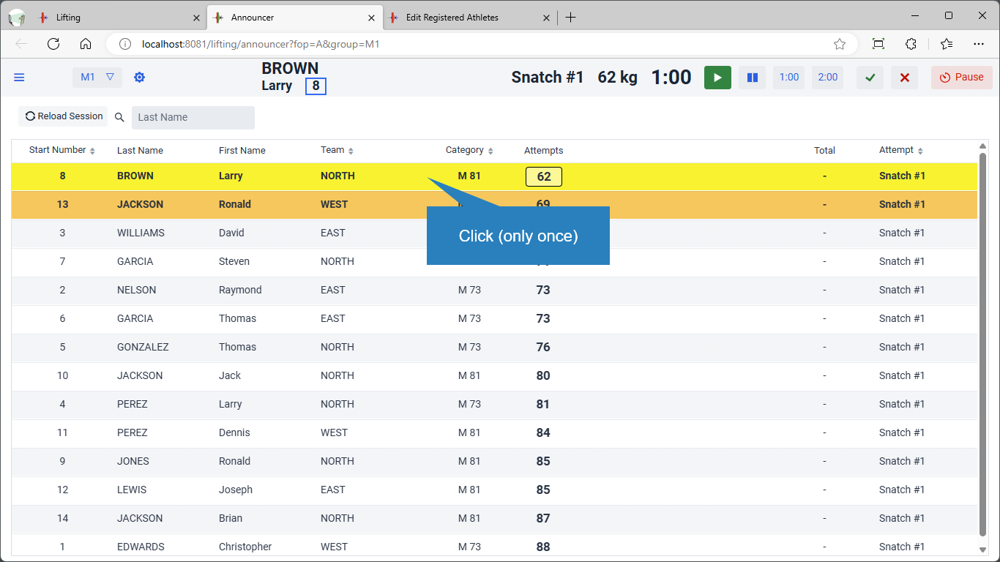

The box where the current change needs to be entered is automatically selected.  You just need to type the number and hit ENTER.

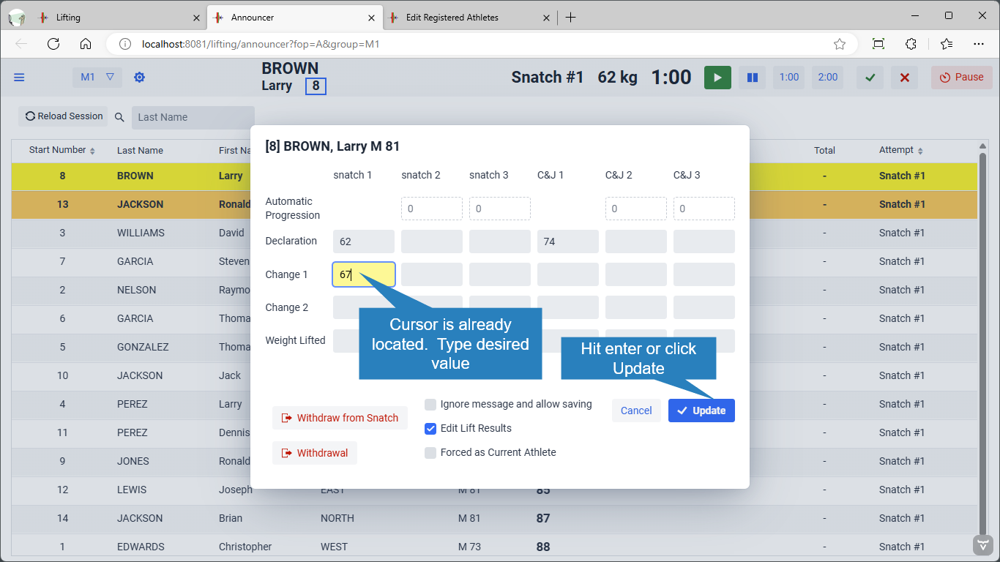

### Notifications

Notifications are shown to the speaker when the weight on the bar changes, and the lifting order is updated if needed.

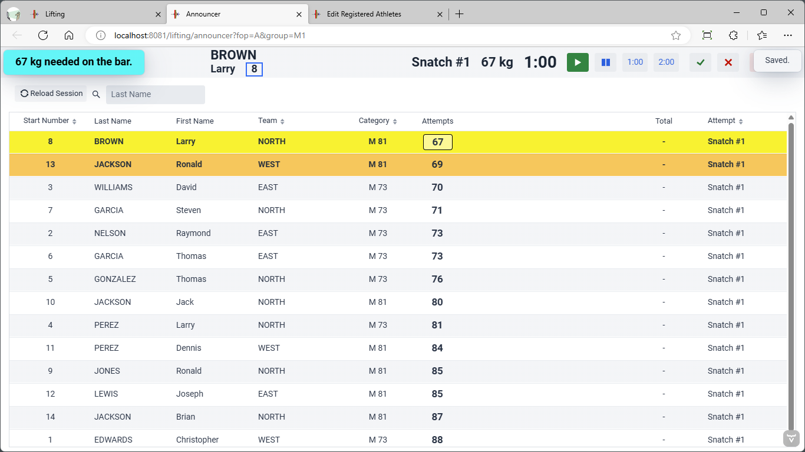

### Announcing the Athlete

All the information required is at the top of the screen.  Normally the speaker would say the sentences in **bold**

- **Loaders, 67kg on the bar please**    (or "**Tighten up 67kg please**" -- if the bar weight remains the same)
- (as soon as the bar is loaded) **This will be the first attempt of Larry Brown, representing club North**
  Whenever possible, it is best to wait for the bar to be loaded to announce the athlete.  This avoids naming several athletes when there are many late changes. 
- (The clock is started if loaders have left the platform, otherwise we wait for loaders to leave)
- **Ronald Jackson, get ready**.

IMPORTANT: the clock should only be started after both the loaders have left and the athlete has been announced.  If you start the clock too early, you may actually prevent legal changes, or cause an athlete to lose a 2:00 break timer to which they are entitled.

### Starting and stopping the clock

To start the clock, when working solo, you use the buttons at the top of the screen

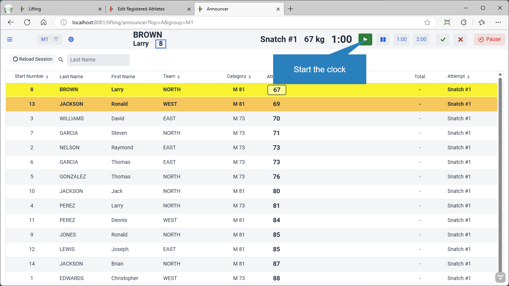

We assume that flags are being used, so we don't worry about the three squares on the left, these are the referee decisions when refereeing devices or phones are used.  The red button is used to stop the clock.   If the athlete puts down the bar before reaching the knees, you can restart it with the green button.

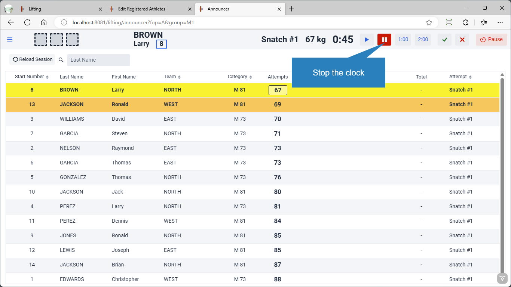

When flags are used, we have to tell the system if the lift was good or not.  This is done by clicking on the green checkmark if good, and on the red X if no lift.  Let us assume it was a good lift.

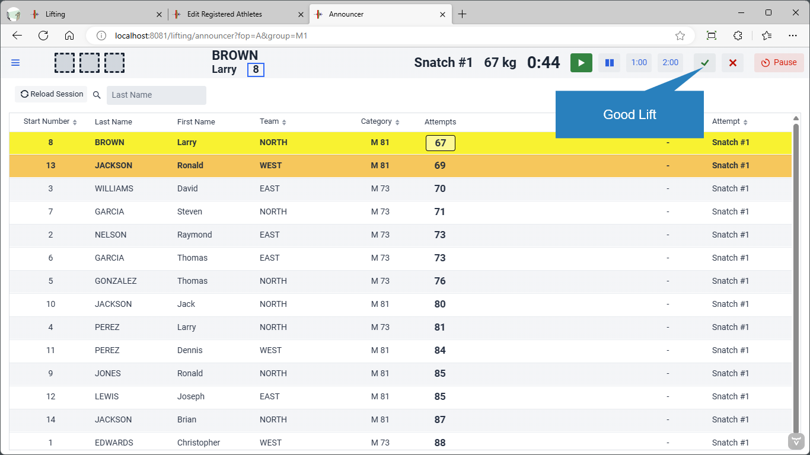

The system confirms.  The speaker announces the good lift.

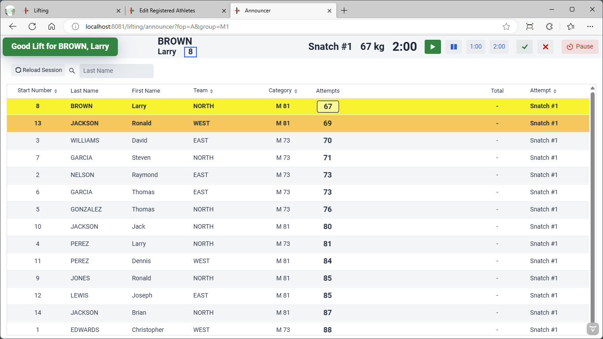

### Automatic Progression

The system records the automatic progression and recomputes the lifting order.  In this example, the athlete is called again.  So the top line is blue, and the clock is set to two minutes.  All clock settings are done automatically.  Normally timekeeper only starts and stops the clock.  A reminder is visible because the bar needs to be loaded to a new weight.

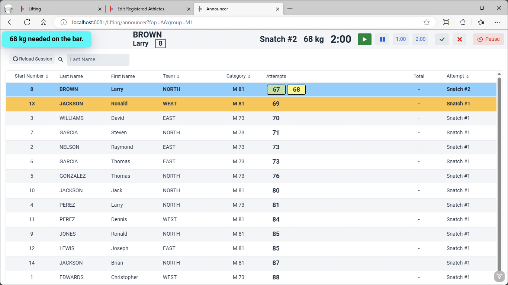

We now start the clock again, as before.

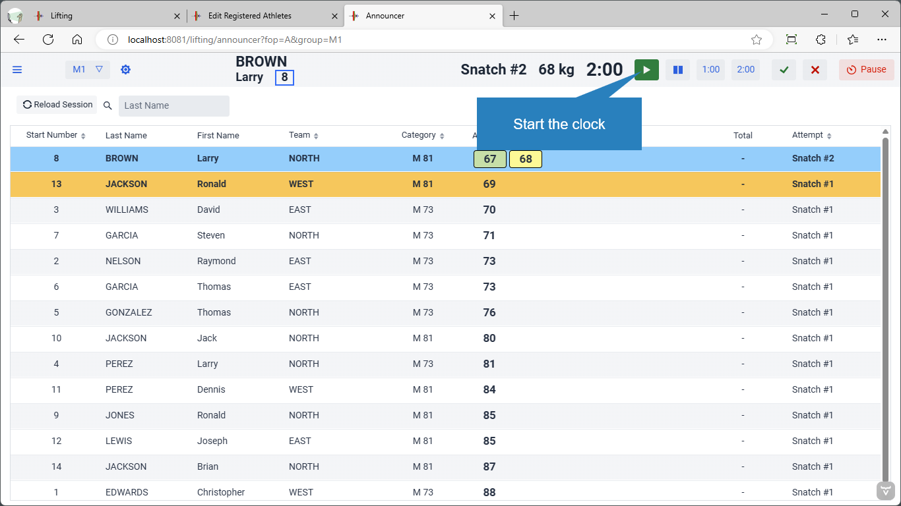

### Change of Athlete

Assume we record a good lift for Brown. As before, automatic progression is applied and the lifting order is recalculated, and the clock is set to the correct value.  Jackson is shown at the top, in yellow.  Reminders are given for the change of weight and the change of athlete

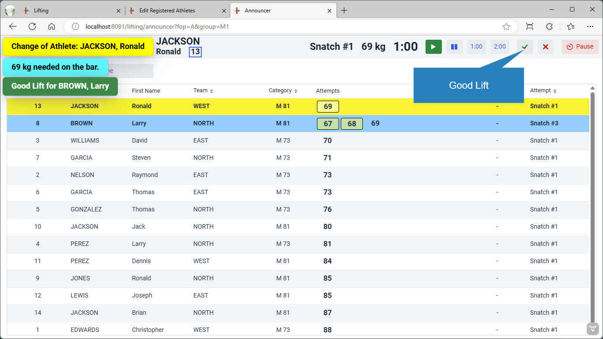

You would keep on doing this, starting and stopping the clock, entering changes, entering good and no lifts, until the end of the session.  The break after snatch is automatic.

