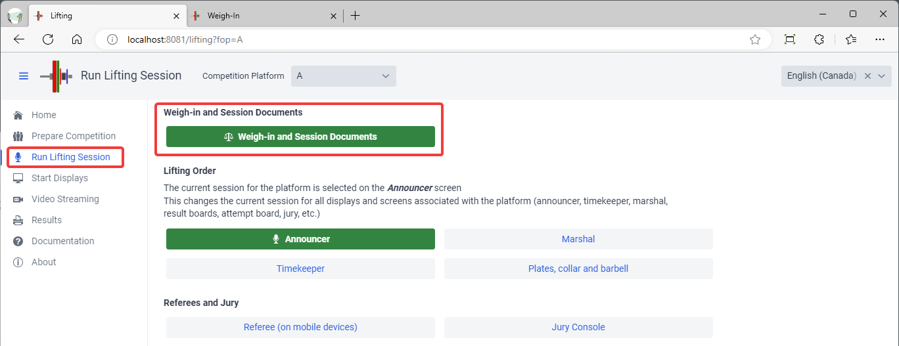
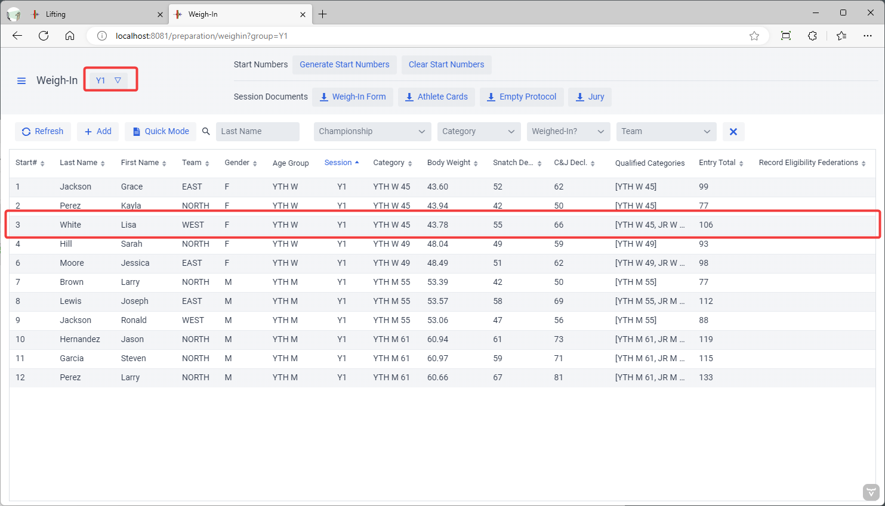
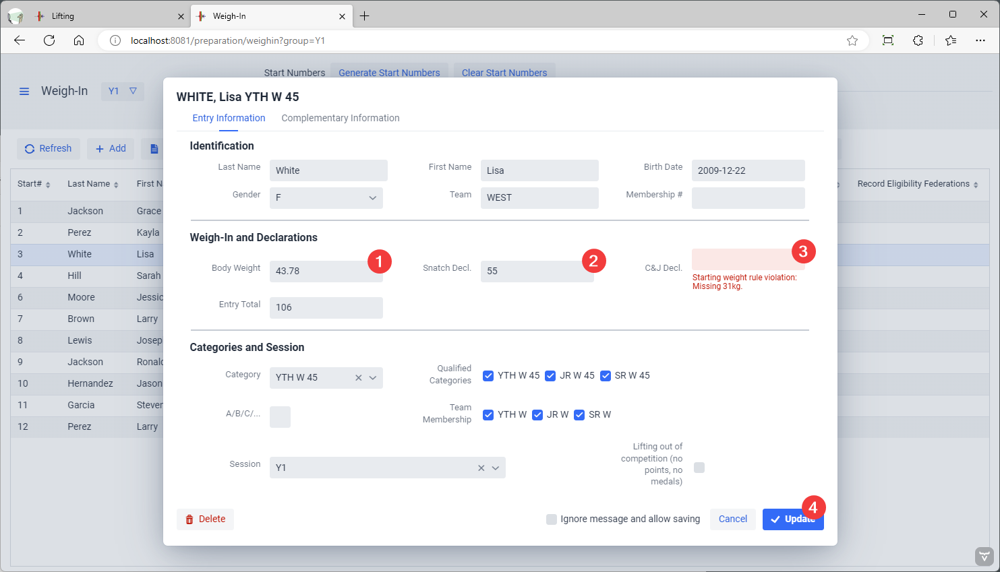
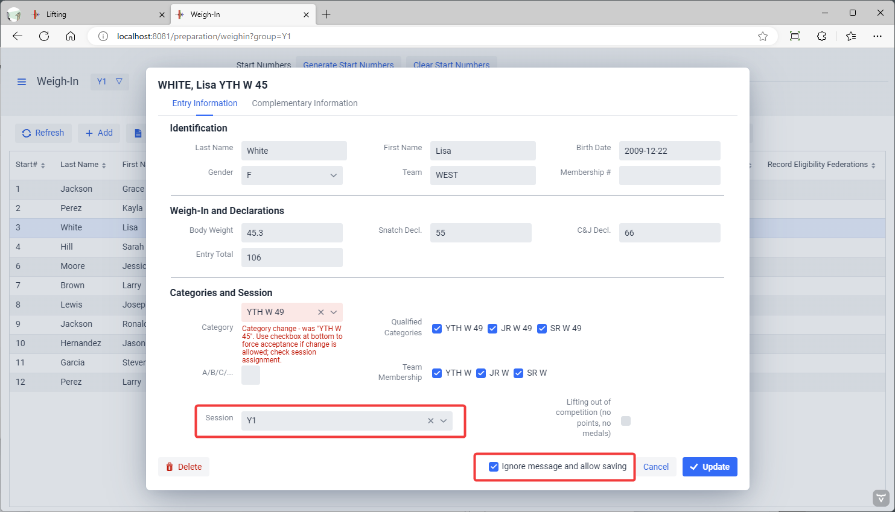
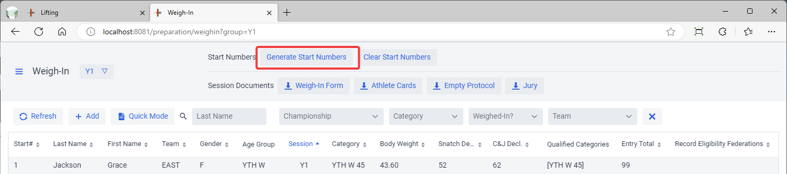
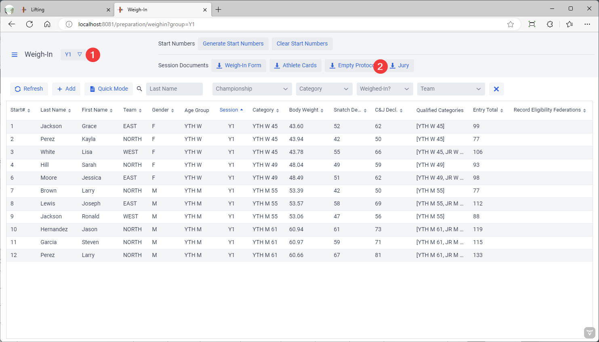
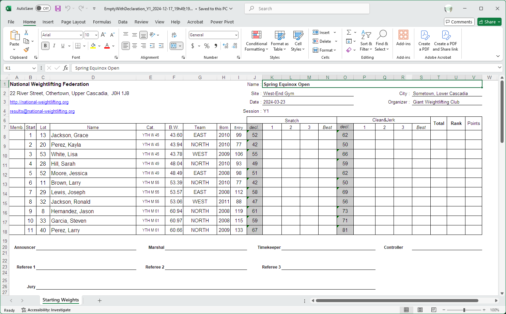

Weigh-ins take place for each group, so the buttons for the weigh-in officials is on the Lifting Group page.

## Selecting a Group and Athlete

The first step is to select the group being weighed-in.  The athlete is selected by clicking ONCE in the list.

## Quick Mode

If information is provided to you on a weigh-in sheet (see the section on [Documents](2400PreCompetitionDocuments), it will be in the same order as shown on the screen.  If you select Quick Mode, when you hit "Enter" or click on Update, you will be brought automatically to the next athlete and you won't have to look up the names.  So you only need to select the first athlete to get going.

## Entering information

The normal sequence is

1. Enter the body weight, use the TAB key to get to the next field
2. Enter the Snatch declaration, use the TAB key to get to the next field.   It is NORMAL to get a warning about the the 20kg rule not being met, since no Clean and Jerk has been entered.
3. Enter the Clean and Jerk declaration. Use the TAB key to get to the next field.  This will remove the warning if the values are valid
4. Use ENTER or click on Update. If the values are still invalid you will remain on the page.

Various validations are made by owlcms and errors are signaled. The most common situation is when the body weight is over the registration category.  The program will propose a correct category, if the qualifying total is met.  

- If the rules of the competition allow moving up, make sure the correct session is selected.
- If the competition rules do NOT allow moving up, use the X next to the session to remove the athlete from the session.
- You will need to check the box at the bottom of the page to confirm you have made the verifications and allow saving.

The Qualified Categories list is used to fine-tune where the athlete can get medals.  In some competitions, athletes may be eligible, but not have been registered in some categories (due to competition fees or other reasons#)

## Start Numbers

Start numbers are used to ensure that lighter weight categories lift before heavier weight categories even if the same weight is requested.  Start numbers are normally assigned at the end of the weigh in.

## Empty Protocol with Starting Weights

The starting weight sheet shows a printout with the start number and the requested weights.  It is printed after all the weights have been entered.  It is used to cross-check that the information printed is the same as on the athlete cards, and to write down the start numbers on the athlete cards.  Some competitions distribute the sheet to the coaches.

You should select the group prior to printing the starting weights sheet.

Coaches can use this to count attempts.  In some federations, this is filled by a junior official to be used as a backup protocol sheet.

### Jury / Referee Examination Sheet

The Jury sheet is used for referee examinations (or as a way to periodically evaluate referees).  It is an alternate version of the protocol sheet with additional information about the referees and a summary of the officiating errors to be noted.

