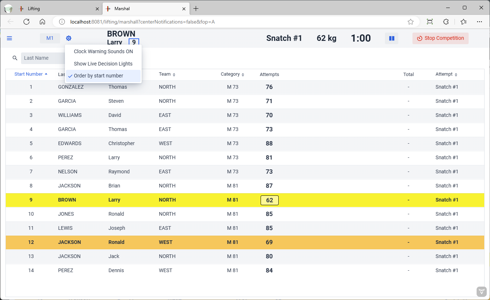
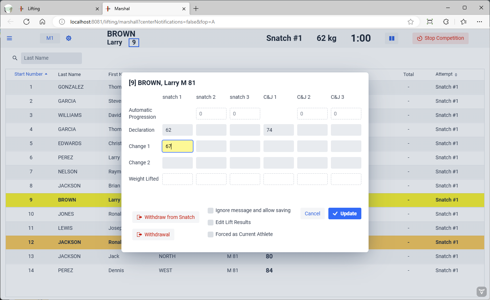
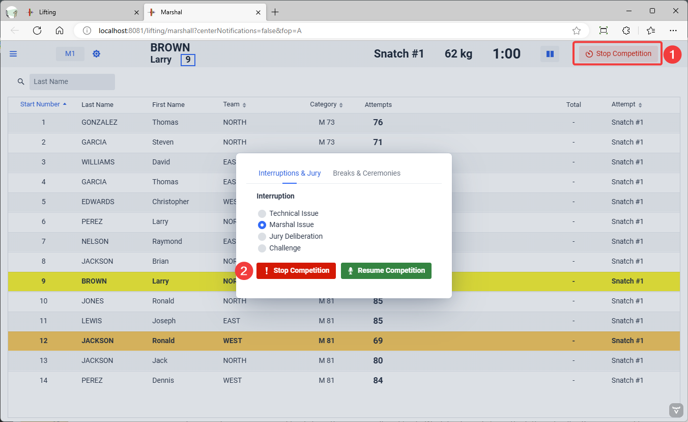
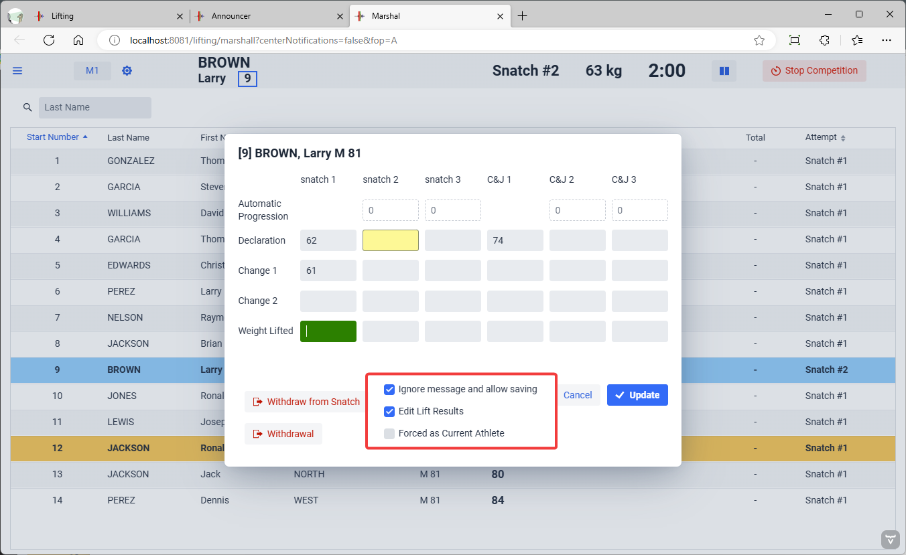

The Marshal screen is selected after using the "Run Lifting Session" menu entry.  Note that all the features available to the Marshal are also available to the Speaker.  It is important to determine in advance who will do what.  Typically, the speaker will handle Jury Reversals, and the Marshals will handle the other types of corrections.

## Selecting the Display Order

In large competitions, the cards are placed on the table in Start Number order.  The number on the cards is used to request changes.  By default, owlcms puts the marshal screen in Start Number order.

In smaller competitions, the cards may be shuffled around to reflect lifting order.  You can use the cogwheel next to the session name to change this option.  Clicking on the "Start Number" heading on the table will also change the sort order if you prefer.

## Entering Changes

Normally, the assistant marshal clicks on the athlete. The cursor is placed automatically on the right cell, so typing the requested number and hitting ENTER is sufficient.

> Only open the card for an athlete when entering a change, and close it immediately.
>
> Do not keep athlete cards open, or open them in advance.   The system may have changed values (such as setting an automatic progression) while you had the card open.  Because the marshal is supposed to have the last word, if you hit Update, you will overwrite what changes have been made.

## Marshal Pause

It sometimes happens that the wrong card is signed, or that the information is entered incorrectly in the system (typos).

When this happens, the first thing to do is to make sure the paper cards are fixed.  Then make sure that the system reflects the information on the cards.

To stop the competition, use the red button at the top right. You will be asked to confirm that you want to stop.

## Correcting Errors

To correct errors, you need to click on the wrong cell and fix it.  Work backwards from the leftmost cells.  You may need to ignore error messages in the process of fixing the card, use the "Ignore Messages and allow saving" checkbox.  This is more likely to happen if the problem affected the lifting order.

You may also need to edit the lift results.  If you are acting as the marshall, by default the bottom line where the lift results are found is not editable.  You need to click on the "Edit Lift Results" to enable that.

## Forcing the current athlete

When loading errors have taken place, the jury may decide to run some lifts again, outside of the normal lifting order.  You then need to use the "Forced as Current Athlete" checkbox.

## Reversing Decisions

If the jury screen or a jury keypad are in use, the reversal of a decision after a deliberation is automatic: the speaker gets a notification, announces the reason, and when the competition is resumed, the decision has been changed.

If the jury is operating manually, then the announcer or marshal needs to reverse the decision.  This is done exactly the same as when correcting an error.  The bottom line labeled "Weight Lifted" is edited: a negative number indicates a "no lift", a positive number indicates a "good lift".  

## Rules for Moving Down

The system will signal illegal changes, and provide a summary explanation.  The rules applied are summarized here.

An athlete may request a smaller weight than on a previous declaration or previous change, but only if this does not cause him to lift out of order.  For example, if on the first lift, athlete A (start number 1) and B (start number 2) both request 80 kg, Athlete A cannot move up to 85, let B lift, and then request 80 again.  By rule, on first attempt, a smaller start number must go first at a given weight.

In summary, moving down is only allowed if the requested weight does not cause the athlete to lift out of order (that is, moving is denied if the athlete should have lifted the weight earlier according the the rules, and is therefore gaining unfair recovery time).  The exact rules enforced are as follow:

- An athlete cannot move to a weight smaller than an already started clock, or an already lifted weight (bar weight does not go down except to correct marshalling or announcing errors)
- If moving to a value for an already started clock or an already attempted weight
  - If an athlete previously lifted the requested weight and did so on an earlier attempt, then the moving athlete cannot move (at a given weight, cannot take attempt 2 before attempt 1)
  - If an athlete previously lifted the requested weight and did so on the same attempt, then the moving athlete must have lifted later (taken a larger bar on the previous attempt - smaller progression)
  - If an athlete previously lifted the requested weight and did so on the same attempt with the same previous weight, then the moving athlete must have  larger start number (for example, on a first attempt start 1 cannot lift after start 2 by moving up, then moving down after start 2 has lifted)
- If an illegal move down is detected, the rule being broken is shown and it is not possible to update.

- Because sometimes there is confusion when entering weights -- similar names, fatigue, etc., the rules can be waived. There is a check box at the bottom that cancels validations and allows saving.  Use with care, this is only meant to fix major marshalling or announcing errors.
- Note: The rules are not applied for mixed children groups with "all girls before all boys" (since the first boy will likely request less than the last girl)
