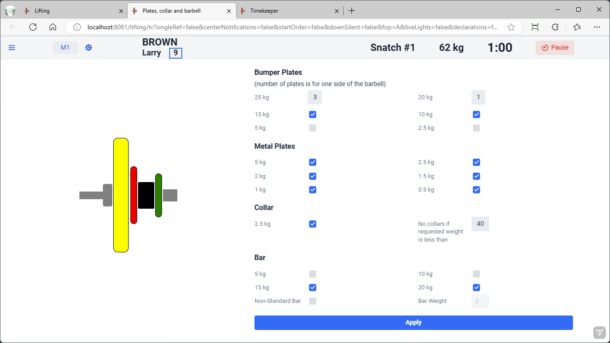

## Technical Controller (Plates, Collar and Barbell)

In school-age kids competitions, it is often the case that a non-standard bar is used (for example a 10kg bar) or that large lightweight bumper plates (2,5kg or 5kg) are used.  

The Plates, Collar and Barbell screen is used to match what is on the platform.  Once `Apply` is clicked the attempt board(s) is updated with the proper graphics.

### Bumper Plates

Change the number of 25kg red plates to what is available.  It sometimes happens that two blue plates will be used in the absence of 3 red plates.

### Collars

You can decide to not use collars, or to set a weight at which they stop being used.

### Bar

Children competitions may use 5kg or 10kg bars.  When these bars are used they will be shown in white (5kg) or green (10kg).  If a 15kg bar is shown for boys, it will be shown in yellow.   Other non-standard weights (like a 15 lb bar that weighs roughly 7kg) will be shown in brown.
