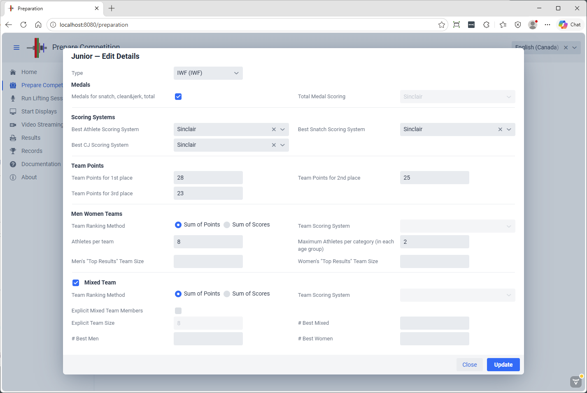
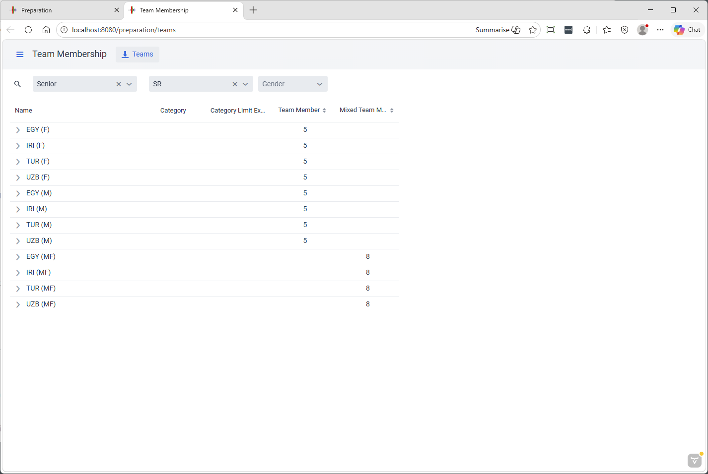
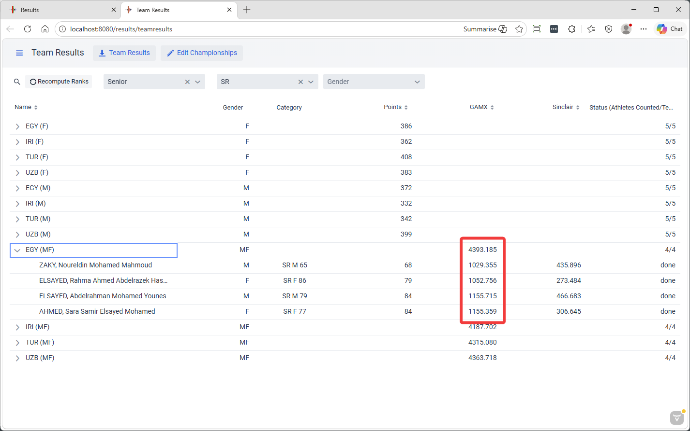

In OWLCMS a Competition can have multiple Championships being held at the same time. A championship defines a set of awards for part of a competition.
By default, there is a championship created for created for each age group, with men and women together.
Championships inherit their default values from the Competition settings.

Each Championship is normally for one age group (Masters are the exception where many age groups share awards)
- it determines if there are medals for total only or for each of the lifts
- it determines how medals are awarded: it can be the traditional weight lifted, or a score like QPoints, GAMX, Sinclair etc.
- it determines the best athlete awards and the score used
- it determines the Team Championships and how teams are given
>
Note that currently an age group can only belong to a single championship.

### Standard Championships

In this first example, we are defining a traditional Junior Championship.  

We intentionally uncheck the "Use default values" checkbox to illustrate.

In this example,

- There are medals for total
- The best Athletes are determined using Sinclair
- Team points follow the normal IWF rules 28 25 23 then 22, 21, etc.
- Teams win according to the sum of points
- There are 8 athletes per team, maximum 2 per category.   *Team Selection is explained [Below](#team-selection)*

It would have been possible to use other rules, for example

- No matter how many athletes registered for the team take the top 3 men and top 2 women (or whatever)

### **Score Based Championships**

In the next example, instead of adding points as in the conventional championships, the winner of the gender-based team championship is determined by adding the scores of the team members

### Mixed Championships

Traditionally, mixed teams championships are defined by adding the points of the men and women teams.  The example below does this

- The format selected is "sum of points"
- the "Explicit Team Members" is NOT selected, so the two men and women teams are combined

### **Score-based Mixed Championships**

There are now scoring formulas that are equitable for men and women, such that it is possible to add men and women scores together.  This can work both with "all men and all women team members count", or with a new capability, naming an explicit mixed team.

- "Sum of Scores"  is selected
- We also decide to select the team members explicitly instead of just combining the men and women, and the team will be a maximum of 8. 

- We could have just added the men+women teams together, and we could have decided to just pick the best n men and best n women instead of naming them in advance.  Each championship can have its 

### Team Selection

To create Explicit Teams as in traditional IWF-style competitions, or for explicit mixed teams, use the Team Membership button on the Prepare Competition page

In this example, the teams were defined to be 5 persons for the gendered teams and 8 for the mixed team

Opening each section allows selecting who is on the team or not using the checkboxes.

> Note that the [Registration File Format](2300EditAthleteEntries.md) supports team membership annotations.  By default
> the athletes are assumed to be part of their gendered team.  This can be changed by adding `/-T` after the category.
> When a mixed team championship requires explicit membership, you can add `+MT` to the markers.
> 
> So `JR M 60/+T,-MT` is valid (this would state that the athlete is part of the gendered team, but not of the mixed team).  `+T` is the default, `-MT` as well.

### Team Results

The results page has a dedicated area for team results

This shows the totals per team

And the details

A summary spreadsheet with the Men Women and Mixed results can be downloaded as well
