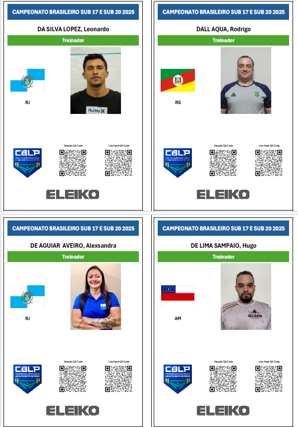

## Creating Accreditation Cards

> [!WARNING]
>
> - This is a new facility.  If you intend to use this, start long in advance, and have a backup plan.
> - You will *very likely need to modify the Excel templates*, and so you will need get yourself familiar with [Jxls](https://jxls.sourceforge.net/) and specifically with [Getting started guide](https://jxls.sourceforge.net/getting-started.html) and the [Image](https://jxls.sourceforge.net/image.html) directive

This capability is triggered from the Prepare Competition > Documents > Credentials button.

The data used comes from the Athletes, Coaches, and Technical Officials Pages.

The templates are located in local/templates/credentials.   The ideal setup is to use international A4 paper, and make the card be a full A4 page.  Then you can use a PDF printer such as PDF24 to create a 4-page-together view. On A4 paper, this makes each card be size A6.  You will very likely need to play with the margins of the template to make the cut lines be in the center.

## Prepare the Photographs

For best results, all photographs should have the same aspect ratio.  We recommend making them all square.  The owlcms program repository includes a Python script that does face detection to help you do this.

Refer to [CROP_README](https://github.com/jflamy/owlcms4/blob/dev62/owlcms/scripts/CROP_README.md) on how to use `crop.py` to crop all your photographs to square format (`--target 1 1`) using face detection (`--face-detect`).  Crop.py is python script, so you will have to install python and follow the instructions to add the requisite packages.

You can use other image ratios, but then you will likely need to modify the templates.

## Adjust the template

Create a copy of the `local/templates/credentials/Athletes.xlsx` file.

Read the documentation at https://jxls.sourceforge.net/each.html to get an idea of how this works.

### Adjusting the LastCell

**Whatever you do, don't remove Cell A1**.  Look at the Note inside.  You will need to adjust the value for LastCell if you add or remove rows.

*We recommend that you don't remove rows or columns*.  Make them very small, but leave them there, it's easier.

### Adjusting the jxls:image directives

The image directive from jxls has been enhanced to work better in this contenté

In the sample template, there are several images included. In particular, there is one for the flag, with a border added, and one for the photo.  

To support resizing of images to cell reanges, **it is critical to provide the `ptHeight` value.**  

- the `ptHeight` value is the total height, expressed in points, of the range.  It is not necessary when the image is in a single row, but mandatory when the range covers more than one row.
- In Excel, select each of the rows where the picture occurs. In the current template, the athlete picture is in 3 rows
- Right-Click on each row number (at the very left of the excel sheet).  In the menu that pops up, there is a `Row Height...` entry.  The number Excel shows is the height in points .  Points are a a traditional typography unit (1 point = 1/72 inch).  Excel works in points.
- Add the points. In the example, the sum of the 3 rows on which the flag occurs is 260.  You can round down a little bit to be safe.

## Printing

The following instructions work best with international A4 paper.  If you have North American letter-format paper, you will need to do some trimming.

On Windows install PDF24, it is the easiest way.  If you are not on Windows, the pdf24.com site has the same tools.

Print the cards to A4 format on a PDF printer (PDF24 on Windows as printer works fine).  ***Be careful to use "No Scaling" as the option.***  There should be one page per athlete.  Save the PDF.  

Open the PDF using the PDF24 tool (the PDF24 app itself). Select the "Pages per Sheet" tool.  Select "4" and "Draw Borders".  With A4 paper this will give you 4 perfectly aligned cards per A4 sheet with a guiding line for cutting.