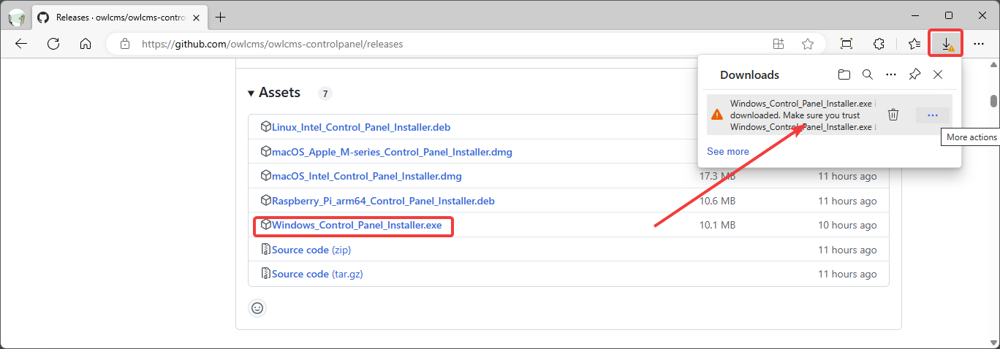
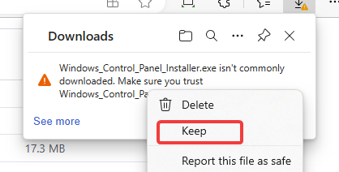
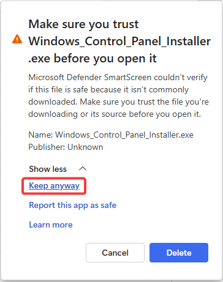
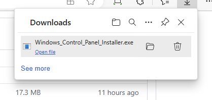
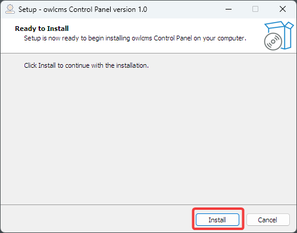
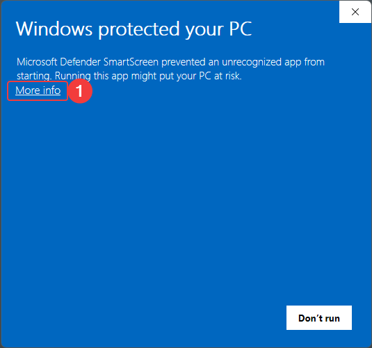
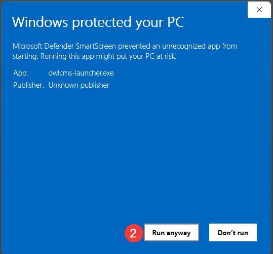

## Dealing With File Warnings

There are two types of warnings you can encounter when downloading installation files on Windows.

- [Download warnings](#download-warnings), where the browser tells you it thinks there is a risk in downloading the file
- [Windows warnings](#windows-warnings), where Windows thinks the file is potentially insecure, and asks you to confirm executing it.  These warnings only happen once.

If you care, go to [bottom of this page](#why-are-there-warnings-anyway) for an explanation for why these warnings can safely be ignored in the case of owlcms.

## Download Warnings

### Option 1: Avoid the issue: Download using Firefox

The simplest way to avoid download warnings is to install Firefox because it does not emit them.  You will however need to deal with [Windows warnings](#windows-warnings) (see below).

### Option 2: Dealing with Edge or Chrome Warnings

Edge is the default browser on Windows.  With Edge, the warnings are more systematic.  With Chrome, sometimes you do, sometimes you don't.  The dialogs are similar on both browsers.

1. If you to to the releases page for the Control Panel and click on the Windows link, you will see a warning.

2. *Move your mouse over the warning* and click on the `...`   If the warning goes away you can use the ↓ icon in the menu bar to make it come back.

   Select the "Keep" option.

   

3. With Microsoft Edge you may in fact get more warnings and need to do `Show More` and `Keep Anyway`
<table style="width: 100%; border-collapse: collapse;background-color:white"><tr><td></td><td></td></tr></table>

4. You should then be able to finally open the file

    

5. And see the installer

    

## Windows Warnings

You may still get additional warnings when starting the Installer or the Control Panel for the first time.  Click "More Info" and then "Run anyway".  This is only needed the first time.
<table style="width: 100%; border-collapse: collapse;background-color:white"><tr><td></td><td></td></tr></table>

## Why are there warnings anyway?

In the past, the programs were signed with a certificate attesting to the author's identity, but this is not sufficient for the program to be considered as trusted.  For the warnings to go away, one of two things need to happen

- either a very large number of people download the program from a given source and Microsoft ultimately figures out it is innocuous, or
- a 500$ code-signing certificate is bought to actually bypass the warnings.

There is not enough traffic for owlcms to trigger the first escape clause

If some kind soul donates the money, I'll do the certificate song and dance, until then, we have to bear with the inconvenience.

## Is there a real risk?

Well, no.  The windows program you are downloading is a very simple packaging that just makes it easier to install the app.  Inside the packaging is the exact same program that runs on Mac, on Raspberry, and in the cloud on Fly.io or Docker.  There is simply no Windows-specific code in there, and the program runs without any special privilege whatsoever.