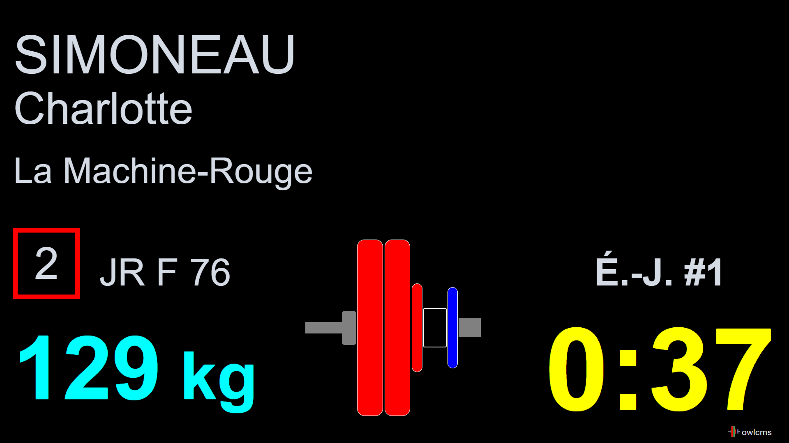

Starting the displays is performed from the `Start Displays`  page.  Commonly used scoreboards are highlighted.

Notes 

- Each display will open in a new tab (or window, depending on your browser preferences).  This allows the announcer to have several displays open in addition to the announcer's own -- for example, to have the scoreboard open in a second tab.
- Displays meant for the public should be maximized.  Use the F11 key or right-click to go to full-screen mode.
- Each display manages its own timer.  Do not hide scoreboards if you use Chromecast or other methods to show them to the public.

## Display Settings

When a display is first started, a dialog comes up to control the the behavior.

- Displays that show a clock give the option to emit the warning sounds at 90, 30 and 0 seconds, as well as the down signal.  
  - <u>By default, the clock display emits sound, and the others such as the attempt board do not</u>. 
  - To avoid confusion, it is recommended to have only one display with sound in each room.  For example, you can choose to have the attempt board emit sound on the main area, and a scoreboard in the waiting area.
- Scoreboards have the option to have a white or black gridbackground.
- There are warmup room displays that do not switch during medal ceremonies, and main room (public-oriented) displays that switch if the announcer uses the medal ceremony features.
- Once the dialog is closed, it can be brought back by clicking anywhere in the window.

## Simple Scoreboard

A standard scoreboard showing the athletes in official order (per category, then per start number) is provided.  The current athlete (having been called or about to be called) is shown in blinking yellow, the next athlete in orange.  

Note that the top line shows the same information as the attempt board (including the down signal and decision lights). So in a smaller competition you may actually do away with a separate attempt board.

## Adjusting the font sizes and column widths

There are two methods to adjust the display

- The first method is to use the arrow keys
  - Up and Down arrows will change the font size
  - Left and Right will change the width of the Team Column
- The second method is to click on the screen and bring up the display options.  This method changes the URL, so you can use it for bookmarking
  - ¨At the bottom are the font size settings. Normal values are between 0.9 (small) to 1.2 (large).  
  - You can also set the width of the "Team column".  Normal values are between 8 and 16 (wide)

## Scoreboard with Leaderboard and Records

This is the official scoreboard content compliant with IWF.  You can turn off the records if they are not loaded, and turn off the leaderboard if you have no A/B/C groups. If you turn off both, you have the same thing as the simple scoreboard.

The leaderboard is for the currently lifting athlete's category at the bottom. This is the athletes' main registration category, same as is displayed on the line for the athlete.

Rankings shown are those across all lifting groups, including those that have lifted earlier (in the image below, the athlete Williams has lifted 70, which currently puts him third, because the 70 from Scott in group M2 shown at the bottom was achieved earlier.)

## Lifting Order

In regional meets, some novice coaches may have difficulty tracking the the lifting order to determine how many attempts remain for their athletes.  The lifting order screen is a non-official screen that is useful in these situations.  It is normally used in the warm-up area.

This shows the alternate "black letters on white background" setting.

## Attempt Board

When a lifter is announced, the attempt board shows all the information required by the referees

- Who is lifting
- Their team
- The start number
- The attempt number
- The requested weight
- The loading chart for the requested weight
- The time remaining

When the clock is started, the time counts down.

Refereeing devices can be connected directly to the attempt board (see [Refereeing](Refereeing)).  If that is the case, as soon as two referees have hit the same button, a down signal and a sound are emitted.  If the devices are not connected directly to the attempt board, the board will be informed by the server, and will emit the signal and sound as soon as it is told (usually, the delay is not perceptible at all).

As soon as the down signal has been given, the system waits for the third decision to be given.  By rule, a 3-second delay is required before showing the decisions to the public (in case there is a decision reversal)

After the 3 seconds, the decisions are shown.

The display then automatically updates to the next lift in sequence.  If records have been loaded and the attempt is a record attempt, this is shown.

## Athlete-facing Decision Display

In front of the athlete, a separate display can be used.  It has less information to be less distracting.  Also, the decision lights are reversed to match the physical location of the referees (referee number 1 is on the right-hand side of the athlete looking at the public, and on the left-hand side for the public looking at the athlete).

Refereeing devices are usually connected to the computer or laptop driving the athlete-facing display (see [Refereeing](Refereeing)).  If that is the case, as soon as two referees have hit the same button, a down signal and a sound are emitted. 

The exact same sequence takes place as for the Attempt Board: first there is the allowed time (1 or 2 minutes, or whatever time is left from a lifter change)

Running time is shown:

Down signal is shown, and sound is emitted.

Three-second waiting period after all three decisions have been entered.

Final decision.

## Top Teams Scoreboard

Team competitions are supported by a Top Teams Scoreboard that show the teams in contention for a medal.  The full Teams results are available to the competition secretary (see [this page](Documents#Team_Results) for details).  Both pages consider points as computed when the athlete's group is done.  So in competitions where there are multiple groups for a single category the points shown are not definitive.

## Top Score and Top Team Score

Sinclair-based competitions are supported by two scoreboards.  The first one shows the athletes in contention for the "best lifter" awards, as well as the weight needed to catch up with first place. 

The score used is actually the Competition-wide best lifter score.

The second display show the sum of the Sinclair scores for the team members.  The top 5 teams are shown.

