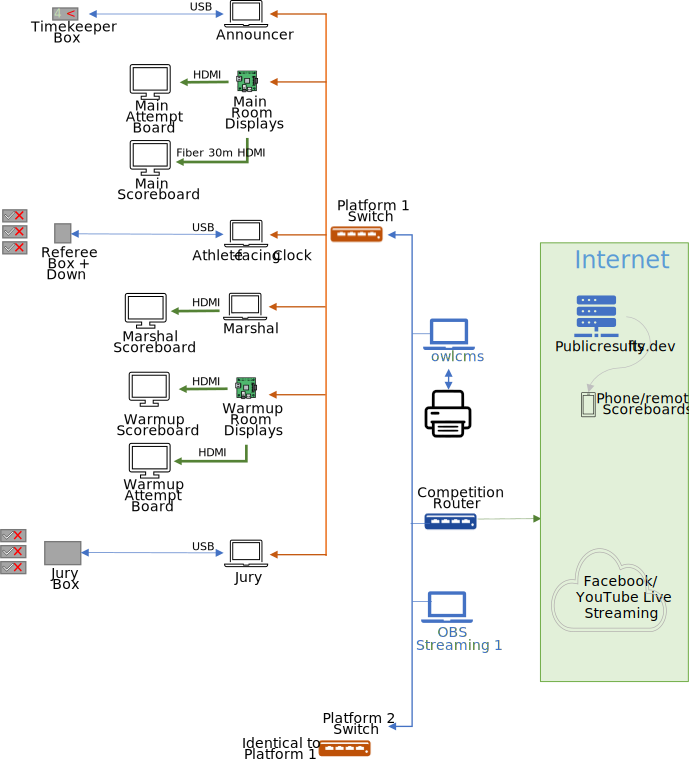
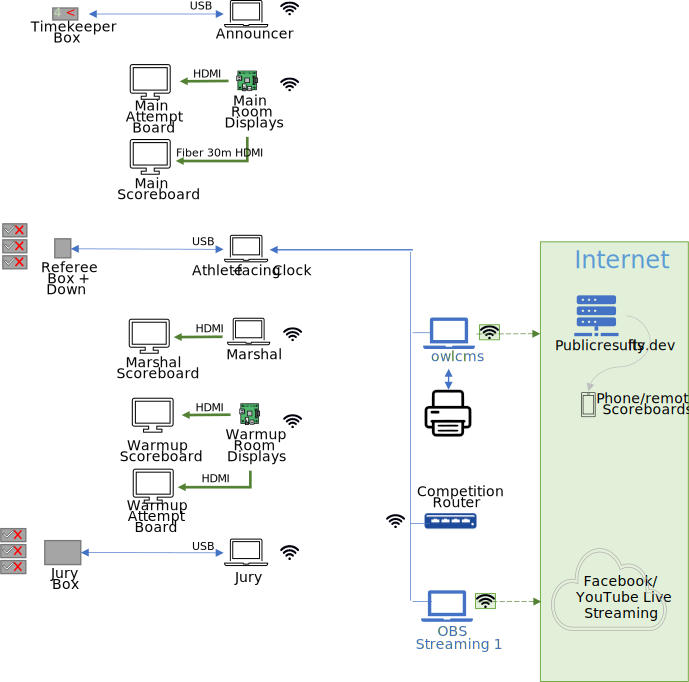

# Physical Setup

owlcms is a web-based application.  All the displays connect to owlcms using a browser.  In most scenarios, owlcms runs on a good laptop at the competition site, and all the other displays connect to that laptop.  For virtual meets, the computer running owlcms is actually running somewhere in the internet -- everything else on this page still applies.

## Minimalistic Setup

In a small club meet, the announcer will often do everything - announce, enter the weight changes, and operate the clock. This can be done on a single laptop, as demonstrated in this [video](Demo1).  You can sometimes even do away with the scoreboard.

## Suggested Small Competition Setup

If you have a meeting with multiple groups, the following setup will allow you to comply with most requirements.  This adds a computer in the warmup area, and there is an attempt board on the platform.

<table>
<tr><td></img></td><td></img></td></tr></table>
Many gyms have a WiFi router, in which case you can simply connect to it (diagram on the left) If there is no Wifi at the location, you will need to bring your own router. Note that we recommend that you use an ethernet wired connection whenever possible, at least for the owlcms computer (diagram on the right)

<table>
<tr><td align=center ></img></td><td align=center></img></td></tr></table>

- The clock and decisions are visible on the attempt board.  The attempt board should visible from the chalk box and from the center of the platform.
- This uses the "extend desktop" capability of the laptop to have a different output on the monitor. 
- If you have an extra laptop and a projector at your disposal, you can add a scoreboard for the public. 
- The next step up is to have the secretary on a separate laptop so that weigh-in data can be entered while the competition is going on.

## Large Competition Setup

At the opposite end of the spectrum, a setup for a state competition using refereeing devices would provide all the requisite displays and technical official stations.  To keep costs down, TVs and projectors can be driven using less expensive devices such as Raspberry Pi, and you can also use HDMI splitters.

There are three building blocks to such a setup

1. Some devices require frequent user input (Marshal, Secretary, Announcer). These are handled by laptops.  owlcms is often run on the secretary computer, only that laptop needs to be recent and performant.  All the other laptops can be basic, or refurbished.
2. The various displays and TVs need a signal.  With owlcms, the signal comes from a web browser.  The most flexible way to do this is to use any of the following
   - Old laptops or Chromebooks that can run Chrome or Firefox
   - Raspberry Pi (the [model 500](https://www.raspberrypi.org/products/raspberry-pi-500/), has everything built-in and is an excellent choice.  They have two HDMI ports and so fewer devices are needed (you can buy long optical fiber HDMI cables of more than 30m if you need to)
   - Mini PCs (preferably with an Ethernet port). Mini PCs also have multiple HDMI ports, so you need fewer devices.  The basic models with 4GB or 8GB of memory are often quite cheap.
   - Chromecasts (this requires internet access for setup, and Wi-Fi has to be of excellent quality). A computer must provide the display being replicated -- a single laptop can drive multiple displays)
3. Video splitters.  Sometimes it is possible to share the output from a PC and send it to a TV.  For example, the scoreboard in the warmup room can be obtained from the marshal computer and shown on a marshal monitor and a warmup room TV.

### Large Competition: Networking for Maximum Reliability

In this setup, all the devices are wired using Ethernet, and the network is private.  The competition can go on if the facility's network is down or if there is no Internet.  

In this approach, a networking switch is used for each platform.  A networking switch is like an extension for the router and allows more wired ports. The internet access aspect is discussed [further down on this page](#internet-access) .

### Large Competition: Hybrid Approach with Wi-Fi

Using Wi-Fi simplifies the setup, but in large venues there are sometimes intermittent (or persistent issues) that don't affect casual browsing, but would interfere with time-sensitive displays.  So for a large competition, we **strongly recommend** to wire owlcms itself and the computer that shows the countdown clock and emits the down signal. 

This yields an alternate setup where a portion of the competition network is WiFi and a portion is wired. The diagram also shows a different way to reach the Internet, discussed [further down on this page](#internet-access) 

## Computer Requirements

- The server software will run either 
  - on any reasonably recent laptop (this laptop will act as a primary server in a local networking setup, see [below](#local-access-over-a-local-network) for details.  In our experience, a Core i5 or equivalent is plenty.
  - or on a cloud service.  The the minimum image size required is 512MB, and 1024 is preferred for large competitions.
- As stated above, for the user interface and displays,  It is recommended to use a recent version of **Chrome**, **Edge** or **Firefox** on any laptop/miniPC (Windows, Raspberry, Mac), or on a specialized display device (Amazon FireStick).  **Safari** also works on iPads, but the smaller screen resolution needs to be taken into account.
- Apple iPhones and iPads are ok as [mobile refereeing devices](Refereeing#mobile-device-refereeing).   Display features such as the Scoreboard and the refereeing displays (attempt board, athlete-facing decisions) also work.

## Sound Requirements

By default, only the athlete-facing decision display emits sound.  See this [page](Displays#display-settings) for controlling the sound parameters for the various displays if you need to enable it on another display.  You should normally enable sound only on one display per room, multiple sources are confusing.

If the equipment used for display has no speakers, you can get the main computer to generate the sounds.   See [these explanations.](Preparation#associating-an-audio-output-with-a-platform)

## Internet Access

If available, Internet access is used for streaming and to publish results to the cloud.   There are 3 scenarios

- You are using a local router and the router is connected to the Internet using Ethernet.  There is nothing to do, all should work.
- You are using the facility Wi-Fi for all the computers, so they all have access to the Internet.  Likewise, nothing to do.
- You are using a local router, but there is no Ethernet access to the Internet.  There are 3 options:
  - If there is Wi-Fi at the facility, you can wire your owlcms and OBS computers to the local router and also connect them to the facility's Wi-Fi. There is nothing required for macOS or Raspberry Pi.  For Windows, see [Using Both Ethernet and Wi-Fi](WiFiPlusEthernet)
  - There is no Wi-Fi, but you can use a phone as a hotspot. You would use the same approach as above, see [Using Both Ethernet and Wi-Fi](WiFiPlusEthernet)
  - You can get a device called a Cellular Router.  The competition router connects to the Cellular Router using Ethernet, and the Cellular Router connects to your LTE or 5G network.