# Self-Service Jury Replays

> This feature is still evolving and if you intend to use it, **you need to experiment extensively beforehand**.  It is documented here so people provide feedback, and report issues.

The `replays` module is a complement to owlcms that provides automatic recording of the lifts and makes them available to the jury.  Multiple cameras are supported. The lifts are automatically trimmed to start a little before the lift and stop after the decisions have been shown.  The jury can watch them using a regular browser, and the replays are organized by session and time (most recent first)

There needs to be one `replays` program running for each platform.   There are options to the replays program if you need to run several on the same computer.

First we show how the program is used, then we provide the configuration instructions.

### Using the Replay Program

The replays program will normally locate owlcms.  So the first thing to do is to start owlcms and wait that it shows its home screen.

> Reminder: Clicking once on a screenshot makes it bigger.

***Announcer Screen***

The session has not been started yet, but owlcms is running.

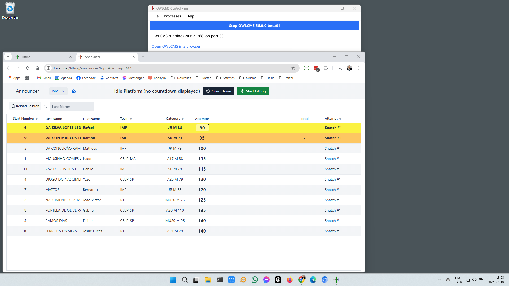

***Jury Screen***

For simplicity, we assume that the `replays` program runs on the jury laptop.  But `replays` can actually run anywhere -- wherever is most convenient for your camera or cameras.  You don't *need* to run the jury console if you have jury buttons instead, this just shows that owlcms is running.

Once owlcms has started  we start the replays program.  If there is no address configured in the configuration file for owlcms, or if the address has changed, it will try to find owlcms -- it will show a "Scanning" message.  

After scanning, it will show "Ready", and you can click on "Open replay list in the browser"

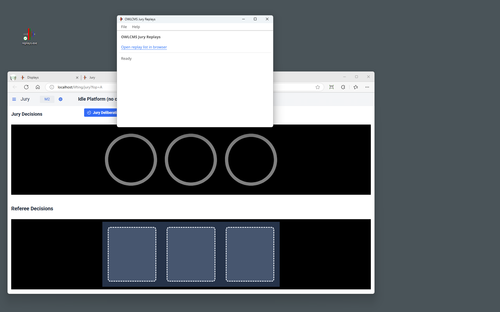

Since we have not recorded anything at all, the web page that opens will be blank.  If you are running `replays` on a machine other than the jury because of your camera setup, you would use the URL shown at the top to open the page on the jury computer.

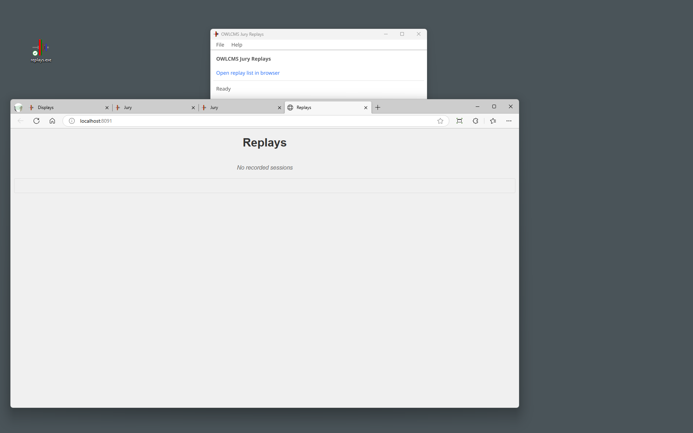

***Announcer Screen***

The announcer or timekeeper will start the time normally.  They have nothing special to do.

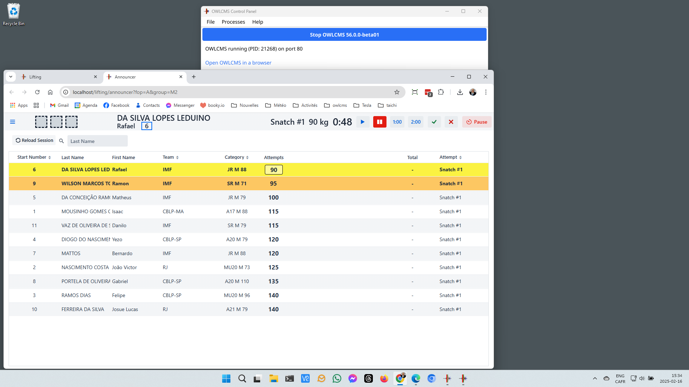

***Jury Screen***

The jury page will automatically switch to the current session and show that things are recording.  The recording page is just another tab in the browser.  You can pull it out to make a separate window if you wish. Or you can just leave the tab hidden until the jury needs to look at a replay.

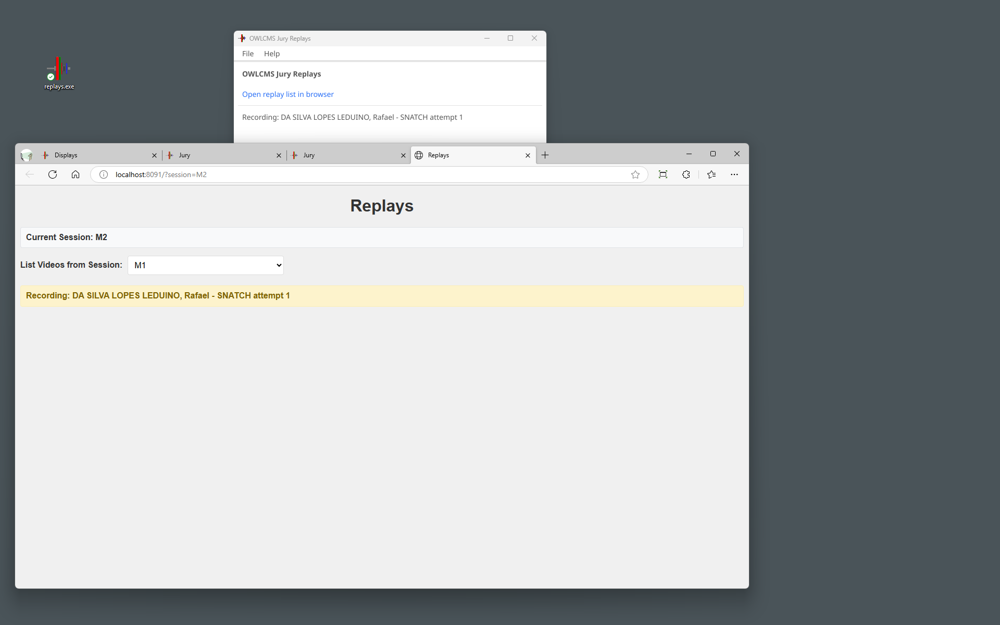

After the decision is made visible, the replay page will show that it is removing the dead time before the lift.

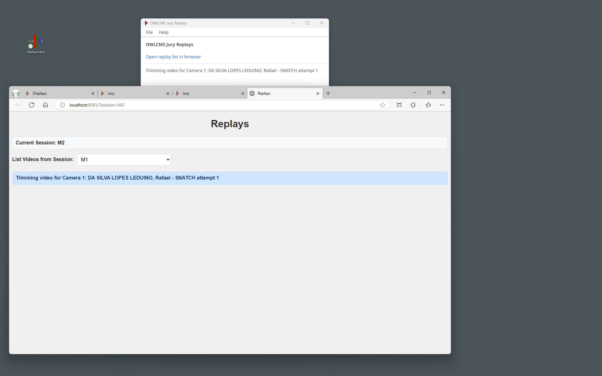

And then the video is made available in the list.  Videos are grouped by session and shown in most recent order first.  The athlete, attempt and camera angle are clearly identified.

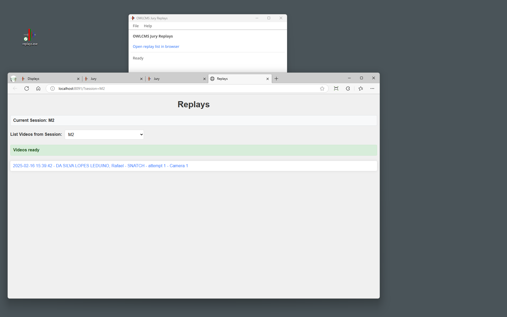

To see a replay, one simply clicks on the video.  Whatever was in front of the camera during the time the clock ran is captured.  The video can be made full screen are looked again.  There is no slow-motion, but you can pause it.

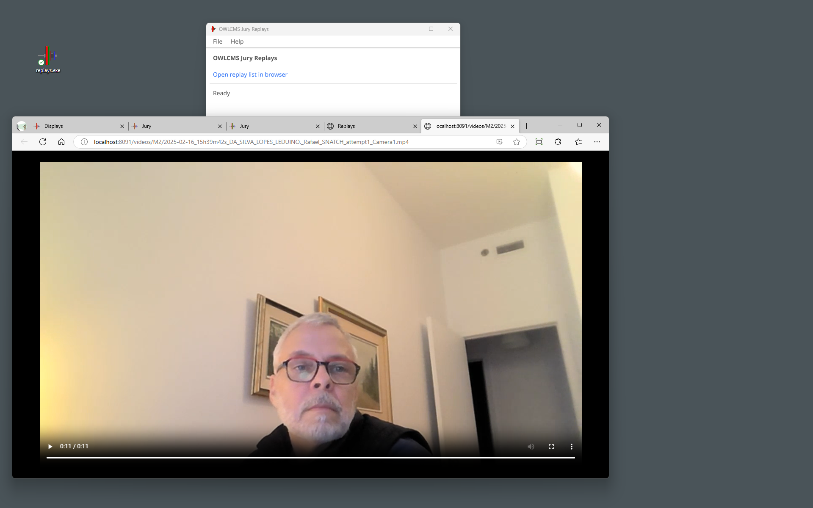

When the clock starts again, the recording/trimming/ready sequence starts again.

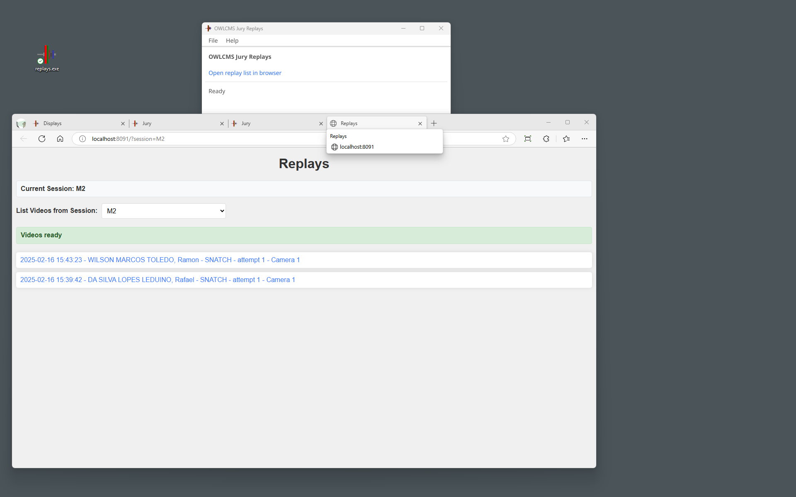

### Accessing the Videos

You can access the video files by using the `File` menu.

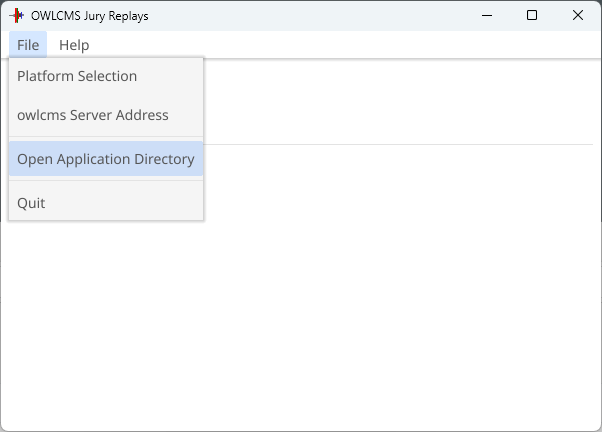

You will then see a folder called `videos` and inside, the videos for all the sessions are properly named.

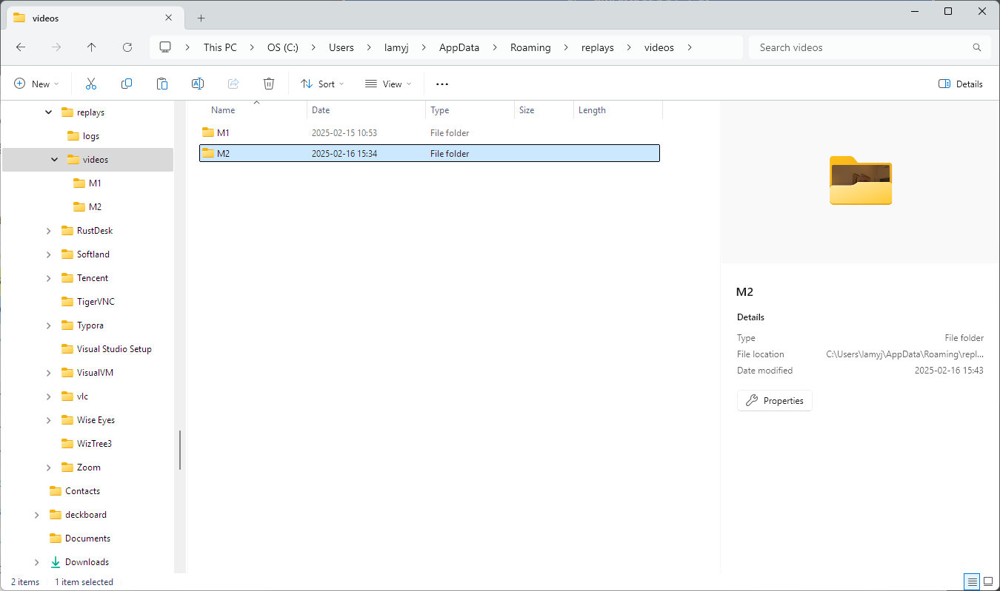

### RaspberryPi: Configuration of the program

**Installation** 

Download the program called `replays` (no `.exe`) from https://github.com/owlcms/replays/releases

- Copy it to the Desktop where you want to use it

- Right-click on the program.  **Set the execution permissions to "anyone"**

**Configuration**

There is nothing to do if you have only one device.  The `ffmpeg` program is already installed, and when you plug in a camera  the USB adapter will be on `/dev/video0`.

If you have more than one camera, open the configuration directory, use the Text editor, and create additional sections `[linux2]` `[linux3]` etc. as needed. 

- Cameras are **even-numbered** (0, 2, 4, etc.). 

- Make sure that `enabled = true` for the cameras you use and `enabled = false` for those you don't.

### Windows : Configuration of the program

**Installation** 

- Download the program called `replays.exe` (with the `.exe` extension) from https://github.com/owlcms/replays/releases

- Copy it to the Desktop where you want to use it

##### Recording Software

You need to be connected to the internet when you first use the program.  The replays program will fetch the `ffmpeg` recording software for you and put a copy in the installation directory.

##### Camera Configuration

Once ffmpeg is installed, you need to configure your cameras.   For this, we need to list the camera names as Windows detected them.

- Go to the `Help` menu and select `List Cameras`.  This will call ffmpeg and obtain the list of available cameras.

For our example, we will configure a camera called `Logitech Webcam C930e`

- Go back to the applications directory.

- Find the `config.toml` file, that can be edited with Notepad

- 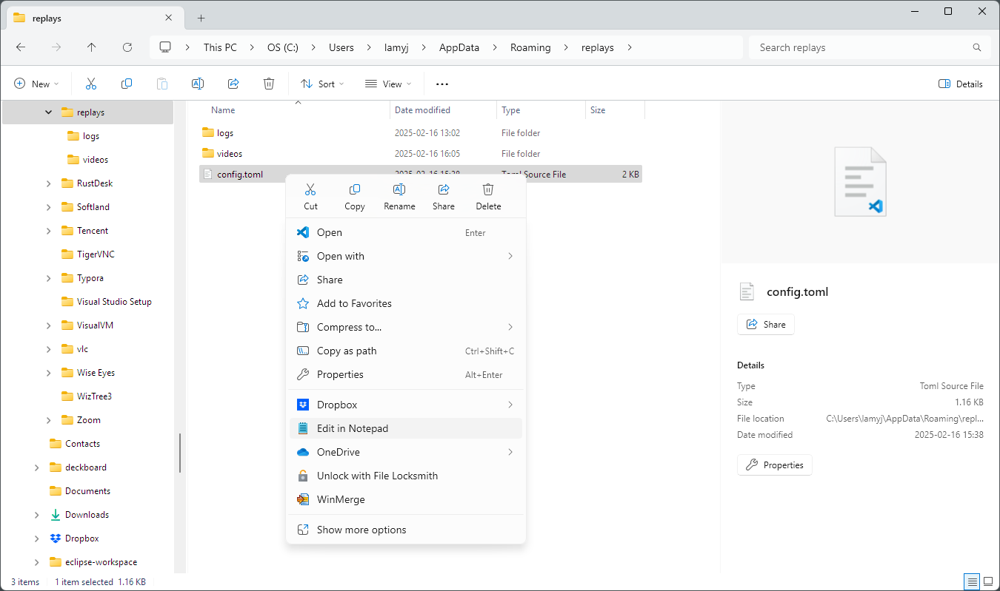

- Then edit the cameras to have exactly the name as in the ffmpeg output.   Locate the `[windows]` section.

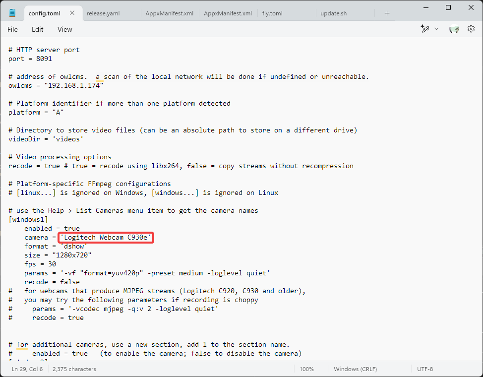

If you have more than one camera,  add additional sections`[windows2]` `[windows3]`  etc.  Make sure that `enabled = true` for the cameras you use and `enabled = false` for those you don't.

Normally you don't need to change the other parameters.

