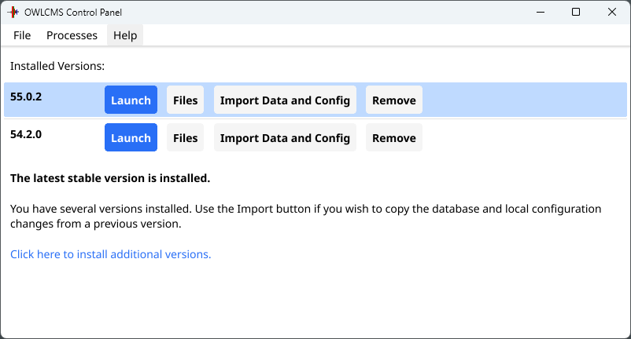

The most common option for using owlcms is to run it locally at the competition site, on a laptop.  The **owlcms Control Panel** is the only software you need to install.  It is extremely easy to use and handles all the steps for running and updating.  The control panel hides all technical details but you can get a glimpse [here](#technical-overview).

## Using the Control Panel

The control panel works the same on all the platforms (Windows, Mac, Raspberry Pi, Linux).  At a competition, only one laptop runs the control panel and owlcms.  **To install the control panel for your computer, see the [Control Panel Installation page](LocalDownloads).**

After starting the control panel, you can start and stop owlcms. To start it, use the Launch button

After 15 to 30 seconds depending on your computer, a browser will show the owlcms home page.  **The address shown on the home page is important: *it is the address that all the displays and technical official browsers need to use to reach owlcms*.**

After launching, the control panel shows a "Stop" button that you can use when the competition is over.  

> **You should leave the control panel open (hide it behind the other windows or minimize it).  Closing the control panel when owlcms is running is the same as clicking the "Stop" button.**

## Updating owlcms

owlcms is updated frequently for new features and bug fixes.  If you don't have the latest version, the control panel will tell you and give you an easy way to update, simply by clicking a button.

> Before you update, it is always recommended to take a backup of your current database if there is important information in it.  To do so
>
> - Launch the old version and use the Export feature found on the Prepare Competition page.  
> - Then use the Update button from the Control Panel

If you prefer, you can keep your current version and install the new one.  This is done using the link at the bottom.

You will then pick your version, and the list will show both versions.

 The "Import Data And Config" button allows you to copy the database (and eventual configuration changes you might have made) from another version.  In this example, we use it to copy from the previous version to the new one.

## Menus

The menu bar gives access to the following options

- **File**
  In order of likelihood of usage
  - **Quit** This exits the program, same as using the X (Windows and Linux) or red button (Mac)
  - **Open Installation Directory**: You would use this to go inside of the installed versions, for example to gather log files at the request of the application maintainers.
  - **Remove All Versions**: this removes all the installed versions of owlcms, but leaves the configuration and Java.  If you use this option and then restart the control panel, you will get the latest version reinstalled.
  - **Remove Java**: this removes the Java runtime engine that actually runs owlcms.  When restarting the control panel, the latest stable version of Java will be reinstalled
  - **Remove All Stored Data and Configurations** Uninstalling the application does not uninstall the databases and the programs and Java.  This uninstalls all that the application copied.
- **Processes**
  - **Kill Already Running Process**  You may inadvertently start two control panels, and try to start two instances of owlcms.  The Control Panel will only allow one at a time.  If you can't find the other control panel to stop the previous one, this entry will try to kill it.
- **Help**
  - **Documentation** links to this web site.
  - **About** shows the version number of the control panel if you need to report a bug.

## Technical Overview

In a typical local setup, a laptop is used as the *main computer*. It can be any reasonable laptop. Often the announcer or marshal computer is used. The control panel is installed on the computer chosen as main computer. 

The control starts and stops the owlcms program.  All the other displays and devices talk to owlcms on the main laptop over the network (WIFI or Ethernet).  

- owlcms runs on a single computer, no matter how many platforms are in use. This is the main computer.  When there are multiple platforms, the main laptop is often dedicated to owlcms instead of being used by an announcer.
- The control panel is installed on the main computer to start/stop owlcms.
- All the other displays connect to the main computer using the HTTP address shown on the initial browser.
- Phones or tablets also connect using HTTP using their web browser.
