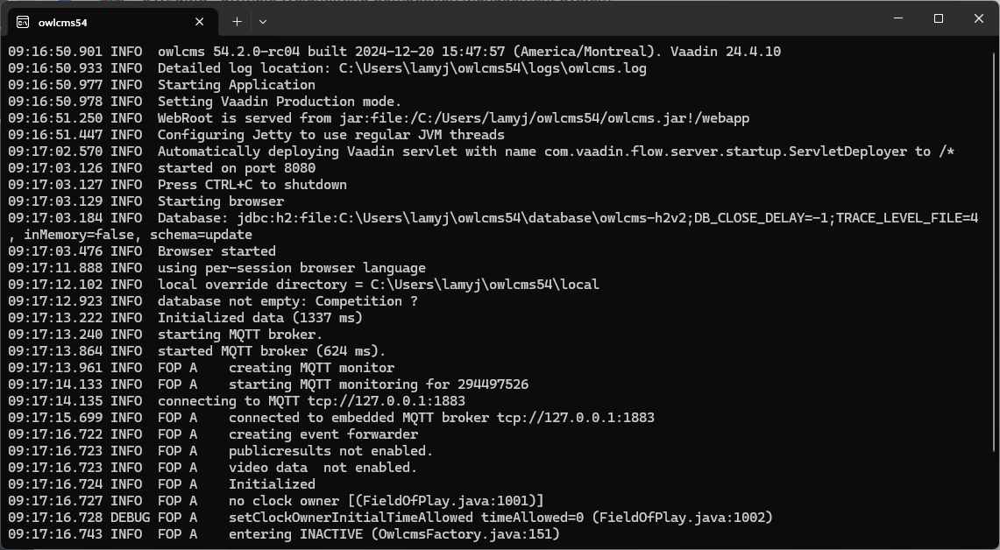
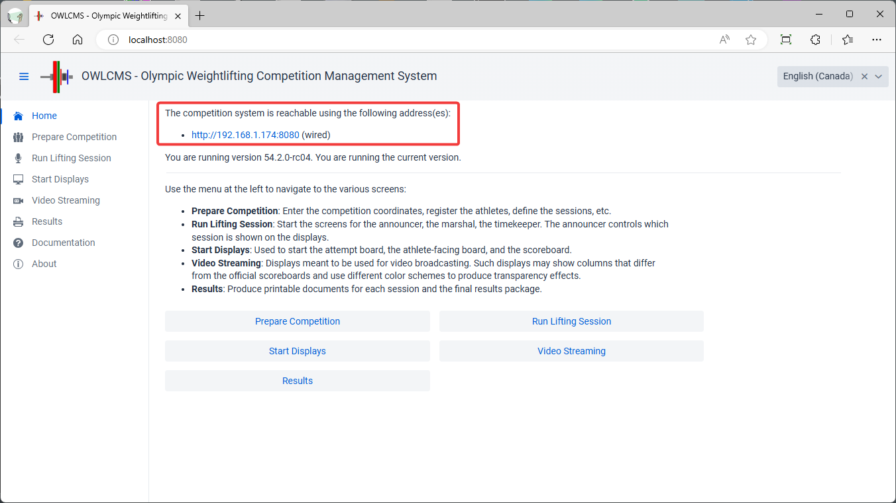

## macOS, Linux or RaspberryOS Installation

> Pre-requisite:  You may need to install the Java language on your computer before installing owlcms. See [Installing Java](#installing-java) section at the bottom of this page to check.

## Installation

- **Get the installation zip archive**: Get the current  **[`owlcms_setup_54.2.1.zip`](https://github.com/owlcms/owlcms4/releases/download/54.2.1/owlcms_setup_54.2.1.zip)** file. Installation files are available as assets at the bottom of each release in the [release repository](https://github.com/owlcms/owlcms4-prerelease/releases/latest) .

  > Tip: [This page](RaspberryInstall) illustrates the sequence of steps on a RaspberryPI and may help you follow along since the process is similar for the other platforms.

- Double-click on the downloaded zip file, and extract the files to a directory. 

  - We suggest you use `owlcms`  in your home directory as the unzip location

- Start a terminal window and go to the installation directory where you unzipped owlcms. `~/owlcms` is the shortcut abbreviation for the `owlcms` directory inside your home. 

  ```bash
  cd ~/owlcms
  java -jar owlcms.jar
  ```
  This will start the program. See [Initial Startup](#initial-startup) below for how to proceed further.

- If you just want to use dummy data to practice (this will not touch your actual database), you can add the following additional options to the java command to start with demo data and run in memory without touching your data.

  ```
  java -DmemoryMode=true -DinitialData=LARGEGROUP_DEMO -jar owlcms.jar
  ```


## Initial Startup

When owlcms is started on a laptop, two windows are used:  a command-line window, and an internet browser

- The terminal (command-line) window (typically with a black background) is where the OWLCMS primary web server shows its execution log.  Something like this will be visible to show that all is going well.  If you have already started the owlcms program, you may see an error message telling you that you can only have one at a time -- you will need to find the other one and stop it.
  

- Normally, a browser will be opened automatically.  If the browser does not open automatically, start a browser and navigate to http://localhost:8080 .  The browser will sit there waiting for the program to finish loading the database and become ready.

- After the browser page loads, if you look at the top, you will see what address to use when connecting from other laptops

  

  In this example the other laptops on the network would use the address `http://192.168.1.174:8080/` to communicate with the primary server.  "(wired)" refers to the fact that the primary laptop is connected via an Ethernet cable to its router -- see [Local Access](EquipmentSetup#local-access-over-a-local-network) for discussion.  

  > When running a competition with a local router, it is recommended to connect the owlcms server to the router with an Ethernet cable.  If a (wired) address is shown, this is the one you should use on the other laptops.
  
  The addresses shown <u>depend on your own specific networking setup</u> and you normally use one of the addresses displayed on the home page.
  
  If none of the addresses listed work, something in your networking setup is preventing access.   The most likely cause is a firewall running on the server or on the network, which will need to be disabled. 

- All the other displays and screens connect to the primary server.  <u>You can stop the program by clicking on the x</u> or clicking in the window and typing `Control-C`.  If you stop the program, all the other screens and displays will wait.  If you restart the main program, they will notice and reload.  Normally there is no need to reload them manually, but there is no harm in doing so.

## Installing Java

Make sure you have a Java17 installed. 

- You can type `java -version` in a Terminal window to see if it is installed, and if so, what version you have.

- If Java is missing

  - For macOS, see [MacOS Java 17](https://adoptium.net/temurin/releases/?os=mac&package=jre&arch=aarch64&version=17) and download the .pkg file. (Temurin is the code name for one of the free Java releases). Double-click the file.
  - For Raspberry Pi, Ubuntu and other Debian variants, type


  ```bash
      sudo apt install openjdk-17-jdk
  ```

  - For other Linux distros, see [Linux Java 17](https://adoptium.net/temurin/releases/?os=linux&package=jre&arch=any&version=17) and choose according to the Linux you run