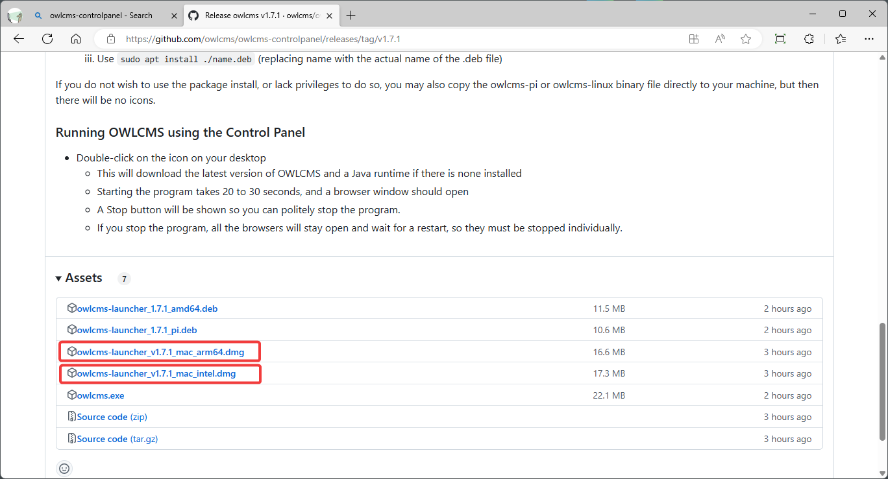
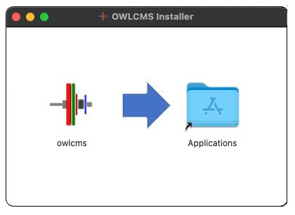

## macOS Installation

### Installation

- Click on this link: [Release Repository](https://github.com/owlcms/owlcms-controlpanel/releases).  **Scroll down to the Assets section**.
  
- Download the file appropriate for your type of computer
  
  - If you have a **newer M1/M2/M3/M4 mac**, get the installation package that ends with **`_arm64.dmg`**.
  
  - If you have an **older Intel mac**, get instead the installation package that ends with **`_intel.dmg`.**
  
  
  
  
- Download the .dmg file to your computer

- Open the .dmg file. 

  

- There are two options for you (you can do both)
  
  - Drag the owlcms icon to the Application icon.  This will copy the control panel app in your Application folder and you will find it there along with your other applications
  - Drag the owlcms icon to your desktop directly.

### Running OWLCMS

- After dragging the app to its location, **Right-click** on it. A warning about running an unsigned application will come up. **Select Open** to authorize the application to run.  *This is only needed the first time around.*

- Once this is done, you can follow the steps shown in the [Local Control Panel Overview](LocalControlPanel)

