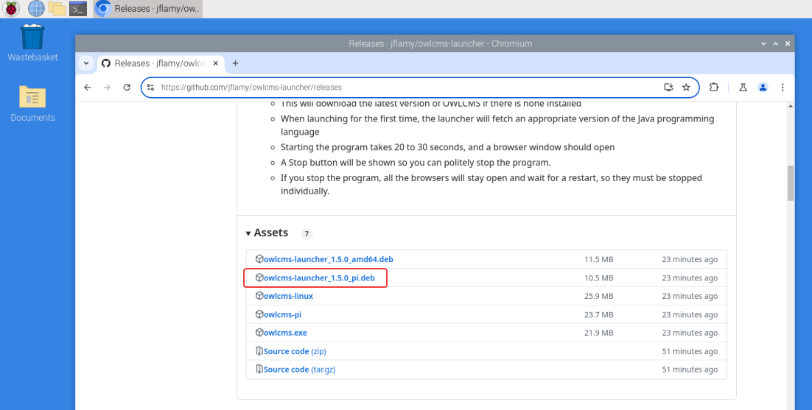
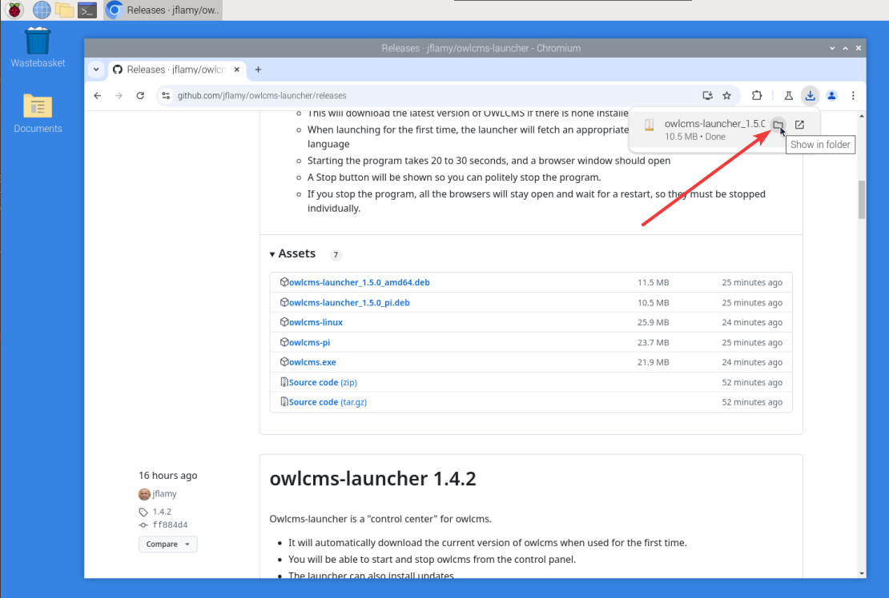
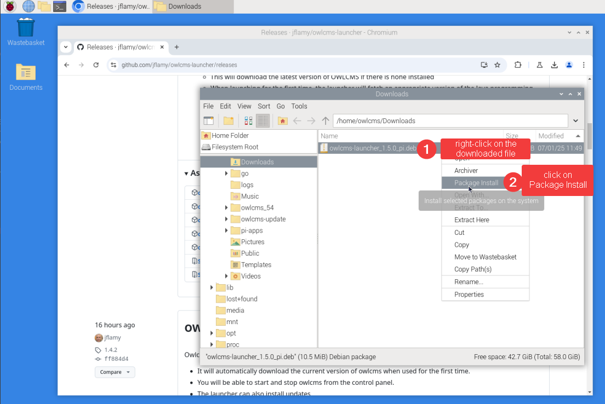
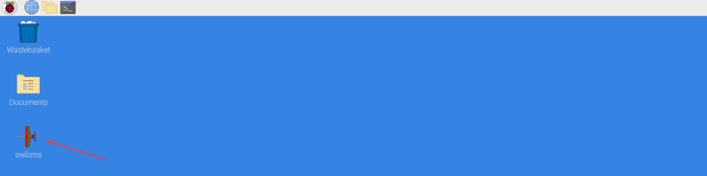
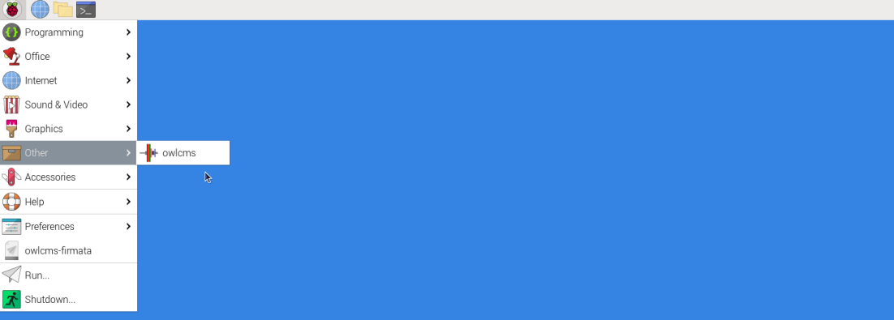
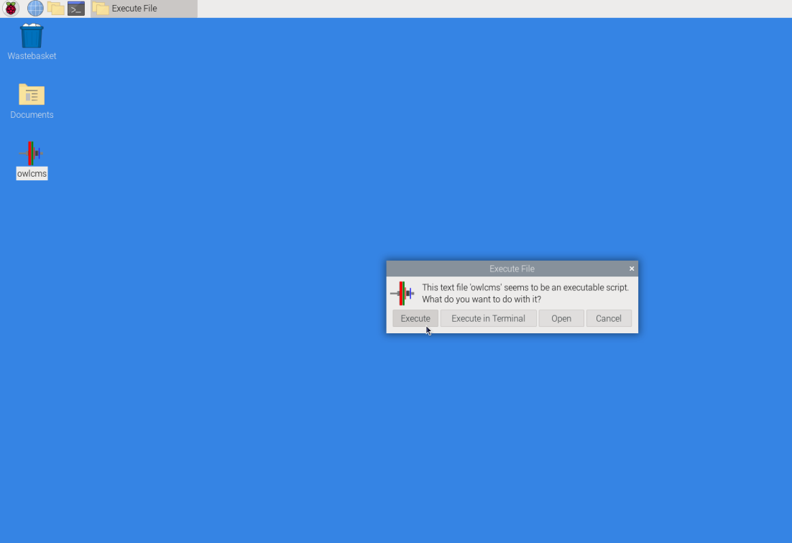

### Installation

- Click on this link: [Release Repository](https://github.com/owlcms/owlcms-controlpanel/releases).  **Scroll down to the Assets section**. 
  
- Download the installation package by clicking on the file that ends with **`pi.deb`.** 
  If you are installing on Intel Linux, use **`amd64.deb`** instead
  
  
  
- **Open the Downloads folder** 
  
  Move your mouse to the right of the download notification.  You should see a small folder icon appear.
  Alternately, use the "..." menu of the browser. Scroll down to "Downloads" to open the list of downloaded files,  and then there is also a small folder icon.

  
  
- Once you see the file, **Right-click on the file name** and then **select Package Install**

  

- Accept the Install prompt and provide your password if requested

- The package will then install, and create a desktop icon,

  

- An entry will also be visible in the "Other" menu

  

### Running OWLCMS

- If you double-click the desktop icon, you will be asked what to do; select "Execute".
  If you use the Other > owlcms menu entry there is no confirmation required.

- Once this is done, you can follow the steps shown in the [Local Control Panel Overview](LocalControlPanel)

