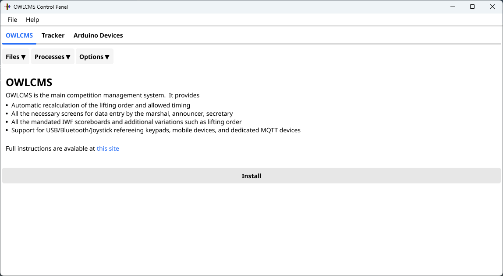

## Windows Installer

### Installation

- Click on this link: [Release Repository](https://github.com/owlcms/owlcms-controlpanel/releases).  **Scroll down to the Assets section**.
  
- Download the file named **Windows_Control_Panel_Installer** 
  If you get Warnings about the file as in the picture, see [these instructions](DefenderOff).  You simply need to insist to keep the downloaded file, multiple times.

  

- Once the file downloads, use the "Open File" link, or go to your Downloads folder and execute the file.

  

- This will start the installer.  The installer will add an "owlcms Control Panel" icon on the Desktop, and a section in the start menu.

  

### Running OWLCMS

- To run the program, double-click on the Desktop Icon, or use the entry for "owlcms Control Panel" in the start menu
  - The first time you run the file, it is possible that Windows will complain.  Should that be the case Click on **More Info** and then, at the bottom, click on **Run Anyway**

- The first time you run the Control Panel, it will offer to install OWLCMS.  This will download and install the prerequisites (Java), and install the latest OWLCMS.
  
- You will then see the Control Panel
- Once this is done, you can **follow the steps shown in the [Local Control Panel Overview](LocalControlPanel)**
