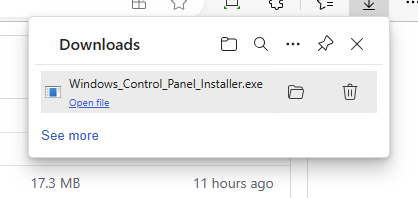
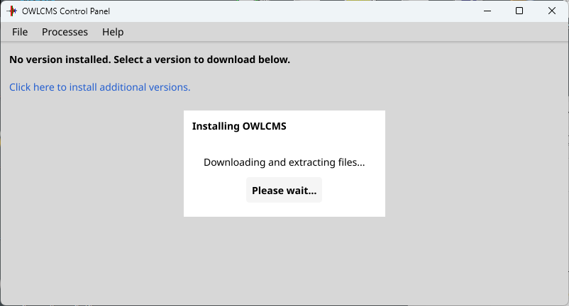

## Windows Installer

> - When the installer was first released, Windows <u>falsely</u> signaled a virus in the installer program.
>- If for some reason your computer rejects the file, you can still download and use the control panel executable program directly, as explained on [this page](LocalWindowsSetup)

### Installation

- Click on this link: [Release Repository](https://github.com/owlcms/owlcms-controlpanel/releases).  **Scroll down to the Assets section**.
  
- Download the file named **Windows_Control_Panel_Installer** 
  If you get Warnings about the file as in the picture, see [these instructions](DefenderOff)

  

- Once the file downloads, use the "Open File" link, or go to you Downloads folder and execute the file.

  

- This will start the installer.  The installer will add an "owlcms Control Panel" icon on the Desktop, and a section in the start menu.

  

### Running OWLCMS

- To run the program, double-click on the Desktop Icon, or use the entry for "owlcms Control Panel" in the start menu
  - The first time you run the file, it is possible that Windows will complain.  Should that be the case Click on **More Info** and then, at the bottom, click on **Run Anyway**

- The first time you run the Control Panel, it will detect that no version is installed and download the current version of owlcms, and the Java runtime files necessary to execute it.
  
- You will then see the Control Panel
- Once this is done, you can **follow the steps shown in the [Local Control Panel Overview](LocalControlPanel)**
