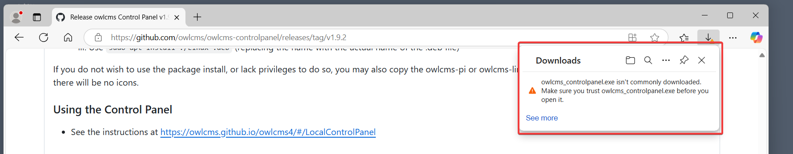
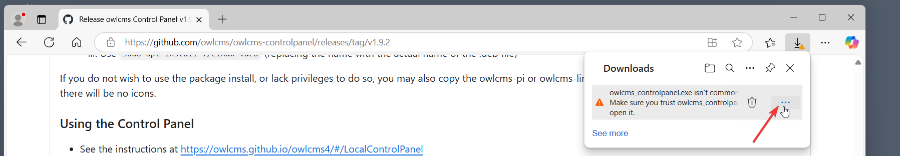
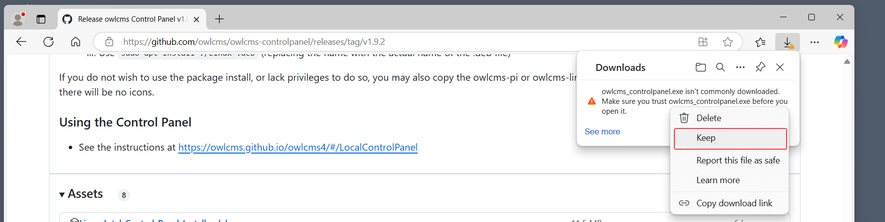
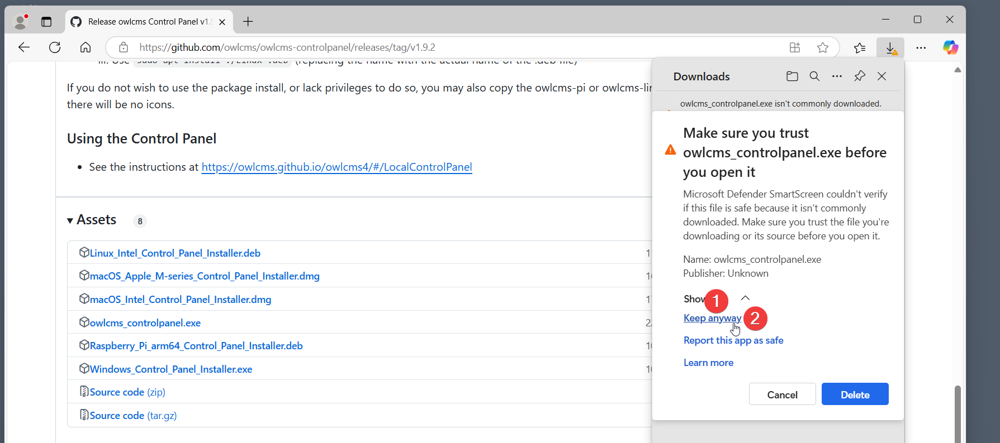
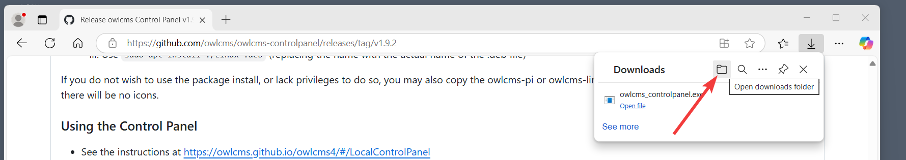
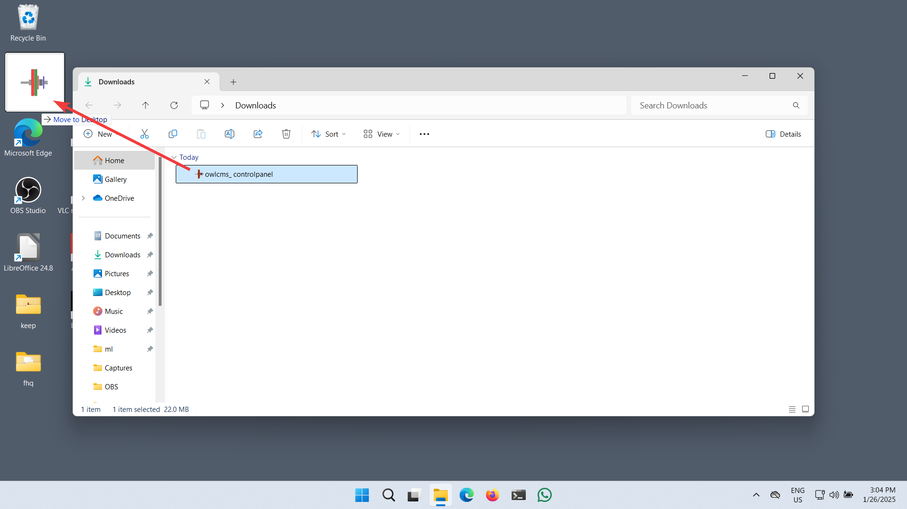
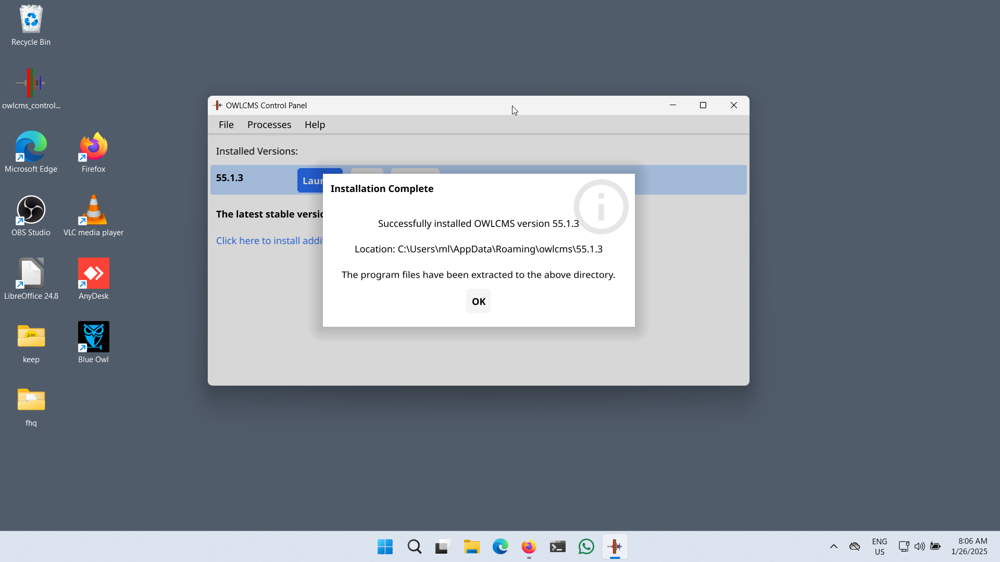

## Short Instructions

If you are familiar with Windows and downloading programs

1. **Download [owlcms_controlpanel.exe](https://github.com/owlcms/owlcms-controlpanel/releases/latest/download/owlcms_controlpanel.exe)** and accept all the security warnings.
2. **Drag** the downloaded file to your desktop
3. **Double-click** on the file.  The first time, this will download the latest owlcms and the files required to run it.  To use the control panel, see [Local Control Panel Overview](LocalControlPanel)

You're done.

## Detailed Instructions

Downloading the file involves a sequence of warnings.  If you are using Firefox, you won't get any of this.  A little bit less if you are using Chrome.  Edge is the one with most warnings, and is illustrated below.

### Downloading

- **Click on this link [owlcms_controlpanel.exe](https://github.com/owlcms/owlcms-controlpanel/releases/latest/download/owlcms_controlpanel.exe)** to start the download process.  You can also go to the [release downloads area](https://github.com/owlcms/owlcms-controlpanel/releases) and click on the file called owlcms-controlpanel.exe
  - You will immediately get a warning that the file is not commonly downloaded.

- Move your cursor to the warning, until you see the ... appear at the right.  

- CLick on the ... and select the option to keep

- You are now asked to confirm your confirmation again (!) Click the "Show" item at the bottom, and then click on "Keep Anyway"

- The file will *finally* download.  
- Locate the folder icon at the top of the box to open the Downloads folder

You can also use the ... menu at the top right of the browser, and then scroll down to the "Downloads area". Once you select that you will see a list and you will also see options to open the Downloads folder.

### Installing

- Once you have opened the Downloads folder, locate the `owlcms_controlpanel` file (you may or may not see a `.exe` extension depending on your Windows settings.)
- Drag the owlcms_controlpanel file to the Desktop (or if you prefer, copy and paste the file to your Desktop)
  - You can rename it or place it anywhere you want.

- To finish installing the program, double-click on the icon you created on the Desktop
  - The first time you run the file, it is possible that Windows will complain with a blue Warning.  Should that be the case Click on **More Info** and then, at the bottom, click on **Run Anyway**

- The first time you run the Control Panel, it will detect that no version is installed and download the current version of owlcms, and the Java runtime files necessary to execute it.

- You will then see the Control Panel

### Running owlcms

- Once this is done, you can **follow the steps shown in the [Local Control Panel Overview](LocalControlPanel)**
