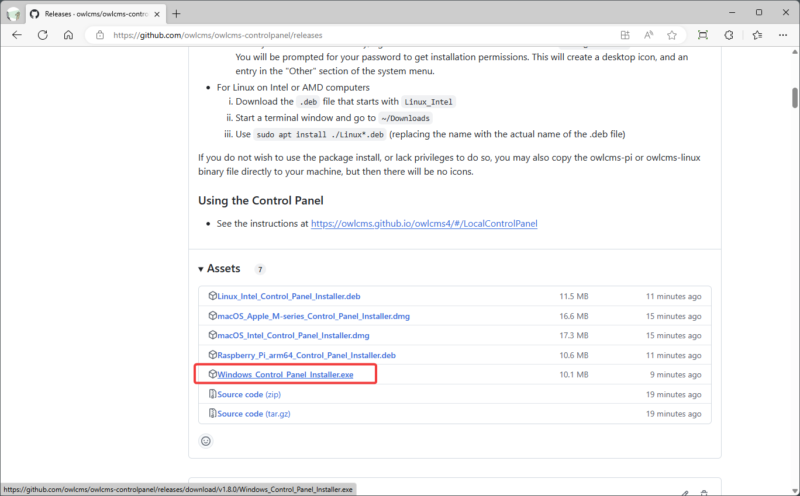
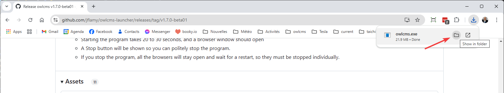
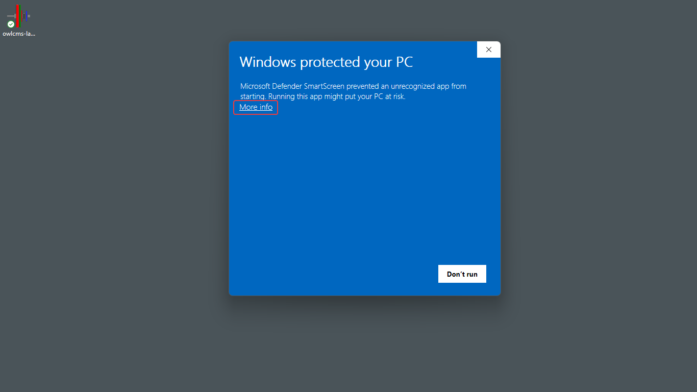

## Windows Installation

### Installation

- Click on this link: [Release Repository](https://github.com/owlcms/owlcms-controlpanel/releases).  **Scroll down to the Assets section**.
  
- Download **`owlcms.exe`** . 
  You may get warnings about a file not downloaded often or potentially insecure.  Select the "Keep" options repeatedly until the file downloads.

  

- Once the file downloads, open the Downloads folder  
  This can be done using the small icon next to the file name. You can also use the "..." menu from the browser and scroll down to "Downloads" to open the list of downloaded files.
  
  
  
- This will show you the directory with all downloads.  **Move the file to your Desktop by dragging it, or using copy/paste**

  

### Running OWLCMS

- The owlcms launcher will now be visible on your desktop. **Double-click on the file**.

  - The first time you run the file, it is possible that Windows will complain.  Should that be the case Click on **More Info** and then, at the bottom, click on **Run Anyway**

  

- Once this is done, you can **follow the steps shown in the [Local Control Panel Overview](LocalControlPanel)**
