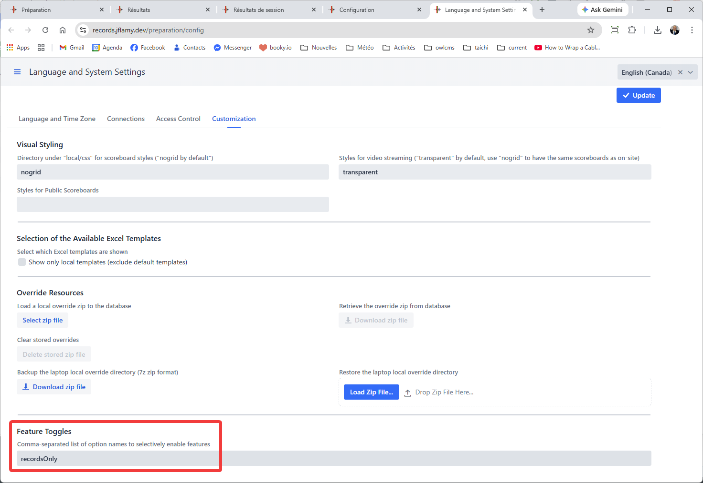
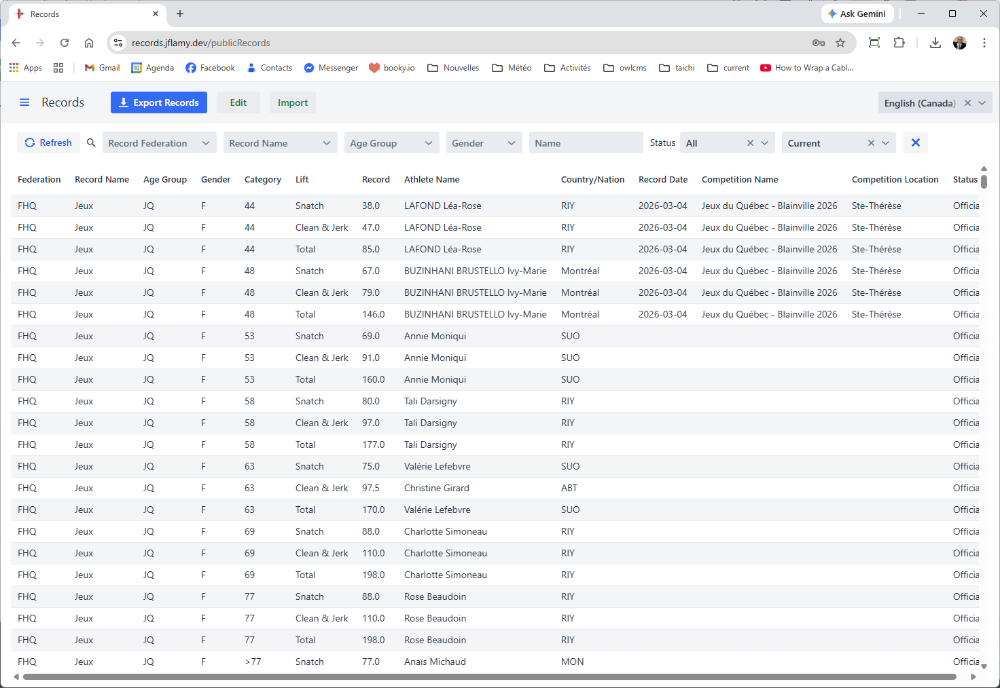
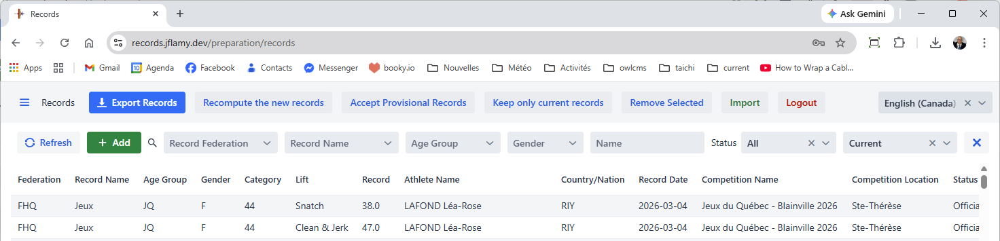
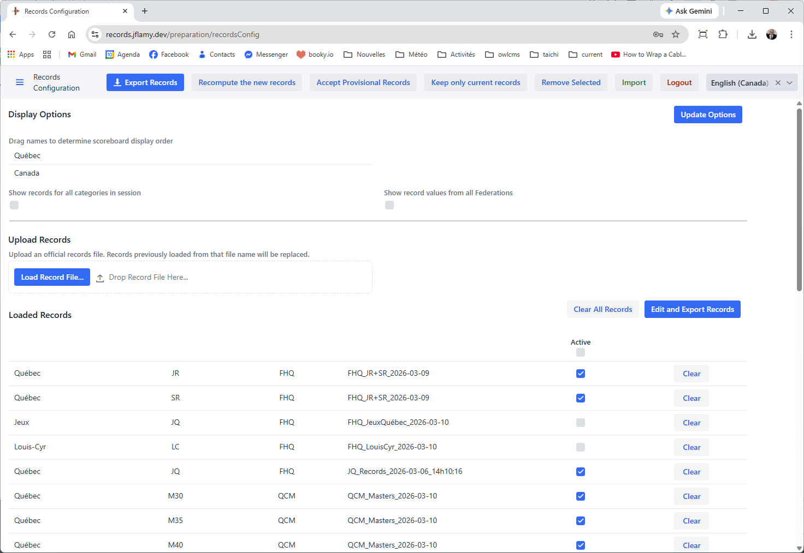
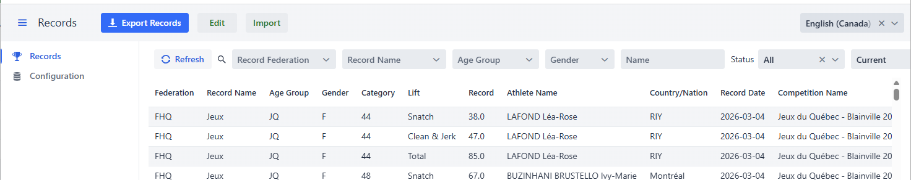
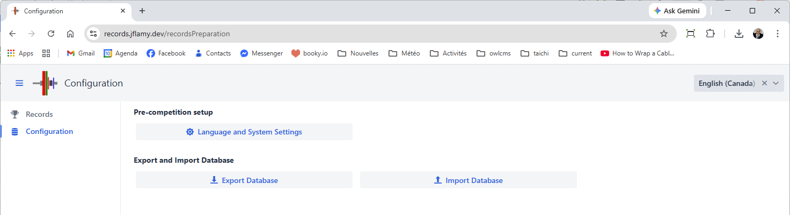

## Record Repository

A Record Repository is a separate installation of OWLCMS that has a special setting that turns it into a records database.

This allows a federation to have an easy to use way to keep, update and publish its records.

### Setup

In order to run OWLCMS in record repository mode, you need to 2 things:

1. Set a password on the Access Control page of the systems settings
2. set the `recordsOnly` Feature Toggle on the system settings Customization page

## Public Access

After setting a password and enabling the toggle, the default page for the site is a read-only view of the records table.

Users can filter the records they need, and export them in Excel data interchange format to load in OWLCMS, or in display format as a basis for publishing them.

## Editing Access

In order to edit records, the green Edit button can be used.  The user is then asked to enter the password.  This enables the full capabilities

## Importing and Selecting Active Records

To import records, the process is the same, using the green Import button.  This opens the normal record import page.  Note that de-selecting active record types makes them invisible, as if they had been deleted.  This can allow a bulk export of all active items, which can sometimes be faster than selecting individual filters.

### Managing the Repository

There is no dedicated button to access the "Prepare Competition" page.  You need to edit the URL at the top of the page and enter `reportsPreparation`  -- the `reportsPreparation` page will add an additional `Configuration` option to the menu

You will then get the relevant subset of administration options.

Note that if you set up the repository in this mode on the cloud, you can take a backup by using the `competition/export`URL (`https://myrepository.fly.dev/competition/export`) will work.  No password is required since you are already making your records public.