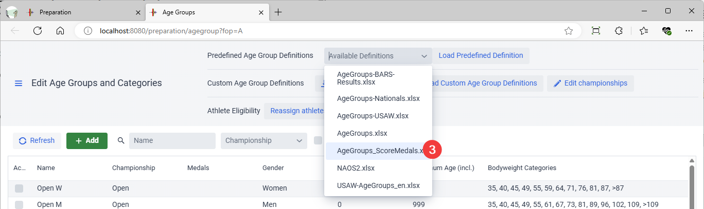
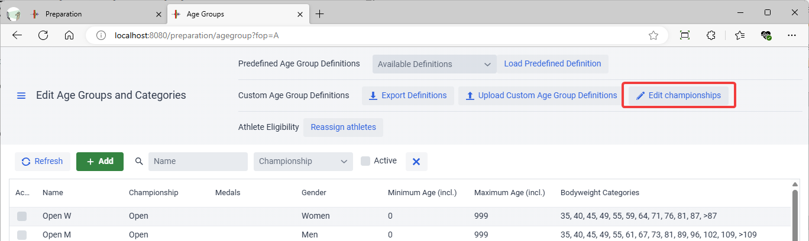
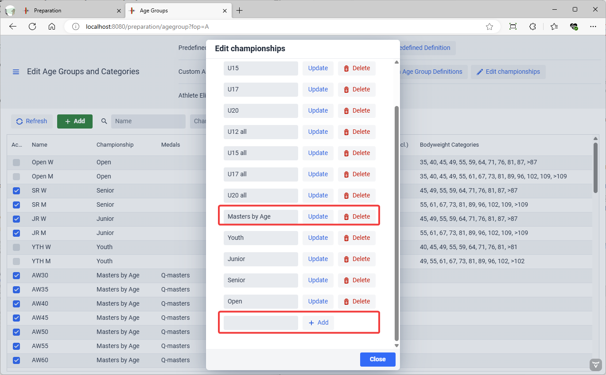
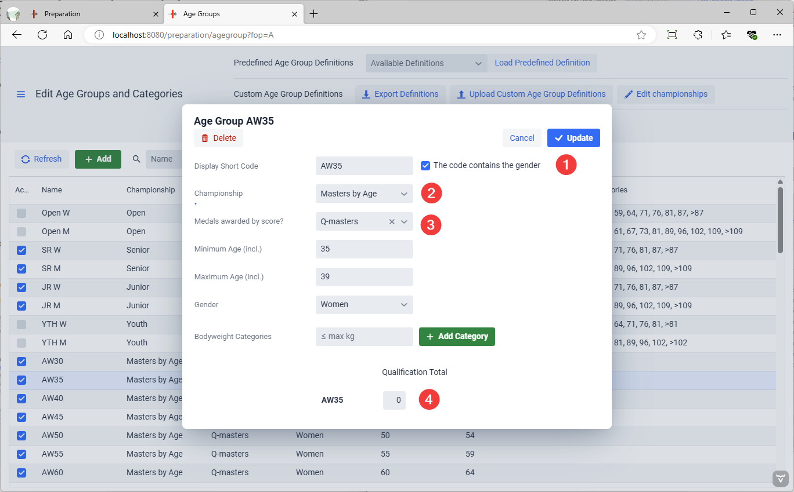
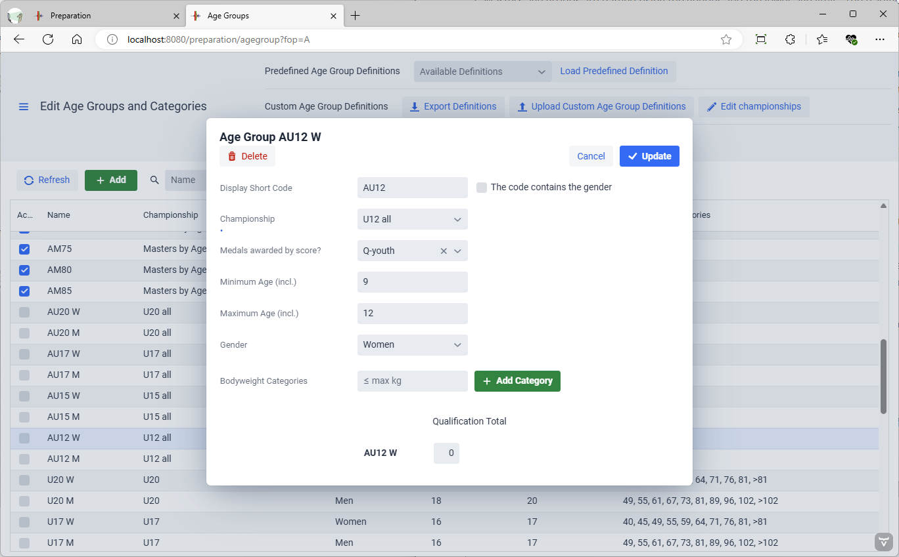
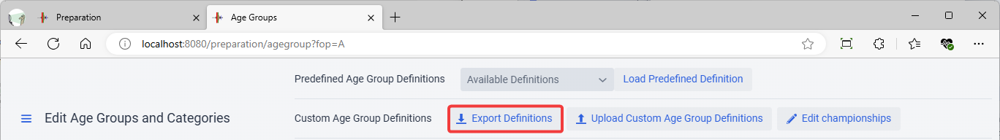
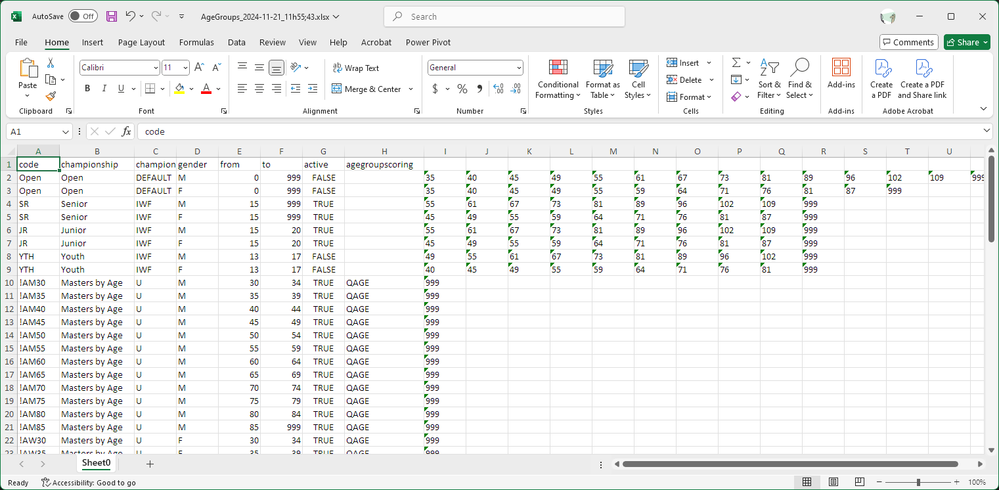
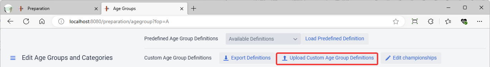

It is sometimes desirable to award medals based on a scoring system.

### Example 1: Score-based medals for all Masters in an Age Group

In many local, regional of even national Masters competitions, there are only one or two athletes a given Masters age group and bodyweight class.  In order to promote competitiveness, some federations award medals for the best score in the whole age group.  This can be done in addition to the traditional medals if so desired.

For this example. Go to the Preparation / Define Age Groups and Categories page and load the predefined file `AgeGroups_ScoreMedals.xlsx`.  Once you master the example, you will be able to adjust your own age groups.

#### 

#### Adding a Championship if needed

To facilitate the production of the competition results, each age group is associated with a championship.  In the case of Masters championships, all the Masters age groups are part of the same championship because the best lifter award and team awards are computed based on all age groups.

> We recommend that you not mix together age groups that have normal body-weight categories with score-based categories in the same championship

So we check that there is an appropriate championship to use, and create it if missing.  To do so, use the `Edit Championship` button

A dialog opens.  You can either rename an existing championship, or add one if missing.  In our example the `Masters by Age` championship is already present.  If it was missing, you would use the `Add` button at the bottom to add it.

#### Editing an Age Group

Close the dialog and click on the AW45 age group.

There are 4 things to mention about this age group

1. Masters age groups are named using the gender and the lower age limit.  The traditional name is W35.  Because we have All the W35 athletes in a single category, we name the group AW35.  The checkbox states that because there is the W in the code, owlcms will not add it again on the scoreboards (we don't want to see "W35 F" on the scoreboards)
2. We select the championship where the age group belongs. All the AW and (later) AM masters groups go to the same championship so we can produce the final results with teams and best athletes easily.
3. We select the scoring system used to award medals.  Q-Masters will be used by IMWA and other federations starting in 2025.  You could pick SM(H)F if you want the traditional Masters formula.
   **This is left empty if traditional medals are used based on total**
4. There is a single weight category, starting at 0 kg.  So all athletes are in that weight category.  When that is the case, owlcms does not display the 0+ or >0 on the scoreboards.

All of the other AW and AM age groups are the same.

### Example 2: Medals based on Age and Weight adjusted totals for Youth

In a club competition, it is often the case that there are only one or two kids in a weight class.  To promote competition, some clubs award the medals based on a score.  In this example, we will use the Q-youth Age-Adjusted Totals.  This applies a factor based on a statistical analysis of young athletes where age and body weight are considered *together* for young athletes. 

The principle is exactly the same as for Example 1.  If you scroll and select the `AU12 W` age group, you will see

Notice that

- The checkbox for "code contains the gender" is NOT selected.  As a consequence, owlcms adds the gender after the code name, separated by a space.  This is why `A12 W` is shown
- The appropriate scoring system is used. When using Q-Youth, it is best to award medals to a smaller age range (due to puberty).  It would not be wise to use Q-Youth for all 9 to 20-year-old athletes.
- There is a single weight category (all bodyweights)
- In the screen listing all age groups, the age group is not enabled -- you would have to click on the checkbox to the left to enable it.

### Exporting the Current Definitions

To keep your changes and reuse them in a later competition, you can export the definition file

We recommend that you make your initial changes using the interface.  For example, add one of the Masters age groups for men and one for women using the interface.  Then export the definition and add additional lines that you need.

In the exported file:

- In column A, the presence of a `!` at the beginning indicates that the code includes the gender

- In column D, the gender is indicated by M or F

- In column C, the values allowed are

  - DEFAULT: there can only be one M and one F line for men and women with the label DEFAULT.  owlcms will not show the code on the scoreboard.   So for example `F 64` will be shown, and not Open F 64.
  - IWF: this is used to state that the age group is a standard IWF group and that the Robi score can be applied.
  - MASTERS: this is the same as putting a `!` at the beginning of the code
  - U: any other age group

- in column F, the use of `999` indicates that there is no upper limit on the age. A category open to all ages will have 0 in column E and 999 in column F

- In column H, the code for the scoring.  Some of the code are there for backwards compatibility so it is always safer to create a first age group using the interface and then export the file to get the correct code.

  - QAGE corresponds to Q-masters
  - AGEFACTORS corresponds to Q-youth

  ### Importing an Exported Definition

  To import adjusted definitions, you can use the following.

  
